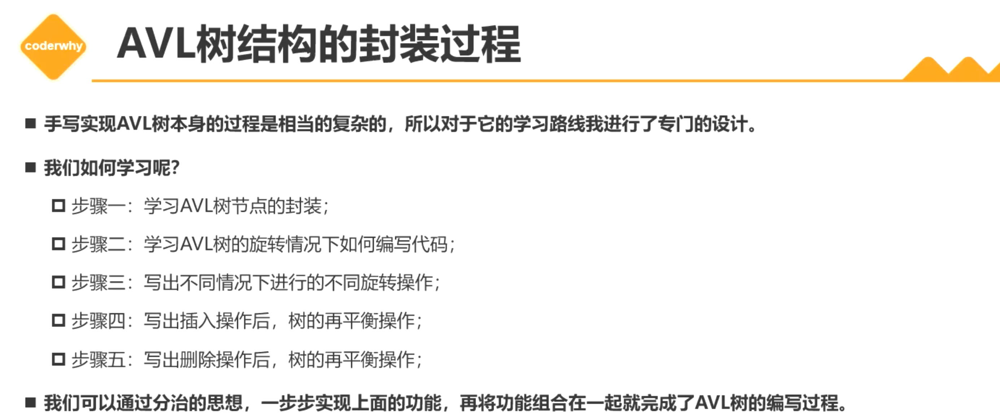

# 平衡树（Balanced Tree）

+ 平衡树（Balanced Tree）是一种特殊的二叉搜索树
  + 其目的是通过一些特殊的技巧来维护树的高度平衡；
  + 从而保证树的搜索、插入、删除等操作的时间复杂度都较低；
  
+ 为什么需要平衡树？ 

  + 假设我们传入一段排序好的，连续的数字插入到二叉搜索树的时候，可以发现，插入的节点都在同一侧，例如下图：
    + 原本的二叉搜索树退化为了一个链表结构，时间复杂度也变成了 O(log N) -> O(N)
    + 如果一棵树退化成链表结构，那么搜索、插入、删除等操作的时间复杂度就会达到最坏的情况，即O(n)
  + 平衡树通过不断调整树的结构，使得**树的高度尽量平衡**，从而保证搜索、插入、删除等操作的时间复杂度较低。通常为O(log n)
    + 平衡树只能保证相对平衡。
    + 事实上，出了插入元素，删除元素也会导致不平衡。

  

+ 如何实现平衡？一般的做法就是插入删除后，根据轴心（pivot）进行旋转。

+ 如何确定轴心呢？

  + 当我们进行对一棵平衡二叉搜索树进行插入删除的是后，每次都是插入或删除一个，都会进行判断平衡。加入存在不平衡的节点，就会去找左右节点中更高的字节点，进行旋转。

  + 不平衡的节点中去找左右节点中更高的字节点

+ 如何旋转？

  + 

## 1. AVL树（Adelson-Velsky and Landis Tree）

+ AVL树是一种 自（Self）平衡二叉搜索树。
+ 它是二叉搜索树的一个变体，在保证二叉搜索树性质的同时，通过旋转操作保证树的平衡。 

### 问题：AVL树是怎么知道自己是不平衡的？

+ 在AVL树中，每个节点都有一个权值，该权值代表了以该节点为根节点的子树的高度差（左子树的高度 - 右子树的高度 = 高度差）。
  + 在AVL树中，任意节点的权值只有1或-1或0，因此AVL也被称为高度平衡树
  + 对于每个节点，它的左子树和右子树的高度差不超过1
  + 这使得AVL树具有普通的二叉搜索树更高的查询效率
  + 当插入或删除时，AVL树可以通过旋转操作来重新平衡树，从而保证其平衡性。

## x. 图包

