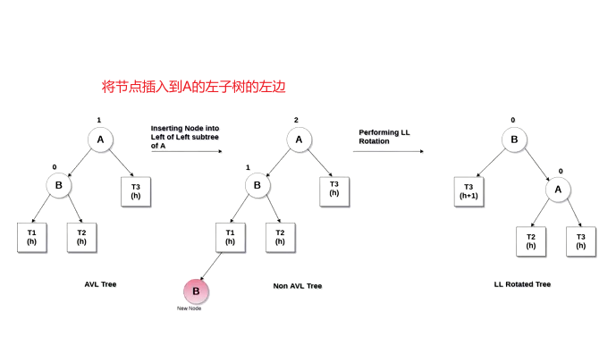

# 平衡树（Balanced Tree）

+ 平衡树（Balanced Tree）是一种特殊的二叉搜索树
  + 其目的是通过一些特殊的技巧来维护树的高度平衡；
  + 从而保证树的搜索、插入、删除等操作的时间复杂度都较低；
  
+ 为什么需要平衡树？ 

  + 假设我们传入一段排序好的，连续的数字插入到二叉搜索树的时候，可以发现，插入的节点都在同一侧，例如下图：
    + 原本的二叉搜索树退化为了一个链表结构，时间复杂度也变成了 O(log N) -> O(N)
    + 如果一棵树退化成链表结构，那么搜索、插入、删除等操作的时间复杂度就会达到最坏的情况，即O(n)
  + 平衡树通过不断调整树的结构，使得**树的高度尽量平衡**，从而保证搜索、插入、删除等操作的时间复杂度较低。通常为O(log n)
    + 平衡树只能保证相对平衡。
    + 事实上，出了插入元素，删除元素也会导致不平衡。

  


+ 如何实现平衡？一般的做法就是插入删除后，根据轴心（pivot）进行旋转。
+ 如何确定轴心呢？

  + 当我们进行对一棵平衡二叉搜索树进行插入删除的是后，每次都是插入或删除一个，都会进行判断平衡。加入存在不平衡的节点，就会去找左右节点中更高的字节点，进行旋转。

  + 不平衡的节点中去找左右节点中更高的字节点
+ 如何旋转？

  + AVL树在设计之初就固定好了它的旋转规律。

## 1. AVL树（Adelson-Velsky and Landis Tree）

+ AVL树是一种 自（Self）平衡二叉搜索树。
+ 它是二叉搜索树的一个变体，在保证二叉搜索树性质的同时，通过旋转操作保证树的平衡。 

### 问题：AVL树是怎么知道自己是不平衡的？

+ 在AVL树中，每个节点都有一个权值，该权值代表了以该节点为根节点的子树的高度差（左子树的高度 - 右子树的高度 = 高度差）。
  + 在AVL树中，任意节点的权值只有1或-1或0，因此AVL也被称为高度平衡树
  + 对于每个节点，它的左子树和右子树的高度差不超过1
  + 这使得AVL树具有普通的二叉搜索树更高的查询效率
  + 当插入或删除时，AVL树可以通过旋转操作来重新平衡树，从而保证其平衡性。


## 2. 如何旋转？

最核心是找到不平衡的节点：再从上开始往下分析：LL/LR/RR/RL。

问题：

1. 如何找不到不平衡的节点？
2. 如何旋转？
3. 如何判断四种情况？

解答：

1. 找不到不平衡的节点

2. 当一棵平衡树插入新节点，导致不平衡的时候：

   + 左左情况（left left 简称LL）：不平衡的节点（root）开始判断下面，左边导致的不平衡，则是L，查看不平衡节点root的子节点（pivot），由于轴心节点的左边插入导致的不平衡，则为LL，需要右旋转。

   

   

   

+ 右旋转：
  + 处理pivot的位置：
    1. 选择不平衡节点（root/this）的左子节点作为旋转轴心节点（pivot）。`const pivot = root.left`即找到轴心节点
       + this就是当前不平衡节点，内部会有方法进行旋转，所有又叫this，下面表达会用root做表达。
    2. pivot的父节点指针指向root节点的父节点。root为不平衡节点，其父节点并没有失衡，不需要做操作。只需要做的是把pivot旋转到root位置而已。（参考上面第二种图）。`pivot.parent = root.parent`
  + 处理pivot右节点的位置
    3. root节点的左节点指针指向pivot的右节点。（pivot的子树节点永远比root小，当发生右旋转的时候，pivot的右节点指针指向root，那么原来的pivot的右子树就移动到root节点的左子树）`root.left = pivot.right`。
    4. 同时也要让pivot的右子树的父指针指向root，前提是右子树存在。`pivot?.right ?? pivot.right.parent = root`
  + 处理root节点：
    5. pivot的右节点指向root。完成pivot的右子树操作，即右子树数据保存好了以后，就可以修改pivot的右节点指针。`pivot.right = root`
    6. root节点的父节点指向pivot。`root.parent = pivot`
    7. 判断是否有父节点，父节点的left/right指向pivot。`root?.parent ?? root.parent.right/left = pivot`

+ 左旋转：

  1. 处理pivot

  ```js
  const pivot = root.right
  pivot.parent = root.parent
  ```

  2. 处理pivot的left

  ```js
  root.right = pivot.left
  pivot?.left ?? pivot.left.parent = root
  ```

  3. 处理root

  ```js
  pivot.left = root
  root.parent = pivot
  ```

  4. 设置pivot的parent的挂载

## 3. 旋转情况

+ 在一颗平衡树里头，会造成不平衡只有这四种情况，所以这四种情况，面对四种情况做对应处理就行。


+ 左左情况：不平衡节点root的左子树导致失衡（L），root的左子节点作为pivot，pivot此时是平衡的，但是pivot左子树的高度的变化导致不平衡（L）。

  也就是说，我们左子树的高度过高导致root不平衡，我们向右旋转。

  + 不难发现，左子树过高，向右旋转。root向下移动，pivot替代root位置，此时root左子树高度就会变小，从而平衡。 

+ 右右情况： 

+ 左右情况：从上往下找，先遇到不平衡节点作为root，左子树高导致的不平衡，为L。pivot此时不平衡，，那么pivot作为新的newRoot节点，发现右子树高导致的，则newRoot的右节点为newPivot，让newRoot平衡，newRoot右子树高，则以newRoot的右子节点为pivot轴心左旋，完成后其实情况就变成了左左情况，一开始的root左节点现在就是平衡的，开始对一开始的root进行平衡，则左子树高，右旋。
  + 可以推理出代码，从上往下找，找打不平衡节点root，假如root的pivot不平衡，则pivot作为一个新root，找pivot，一直找到平衡的那个pivot，开始旋转，然后递归回去。
  
+ 右左情况：略

## 4. 如何找到不平衡的节点？

+ 每当我们插入节点的时候，往上找父节点，判断是否不平衡，直到只掉根节点

  ```js
  // 在已经平衡的二叉搜索树上进行插入
  while(node) {
    if (判断node是否平衡){
  		插入节点后，只会出现四种情况，平衡树操作，四种旋转情况
  		break // 旋转后就平衡了，不需要继续往前找
    }
    
    // node平衡继续找父节点
    node = node.parent
    // 知道找到root，那么root的根节点为null，打断循环
    
  }
  ```

  

+ 对于一棵平衡树来说，插入节点，插入节点的父节点一定还是平衡的。所以一开始可以从插入节点的**父节点**的**父节点**开始找起。


## x. 图包


