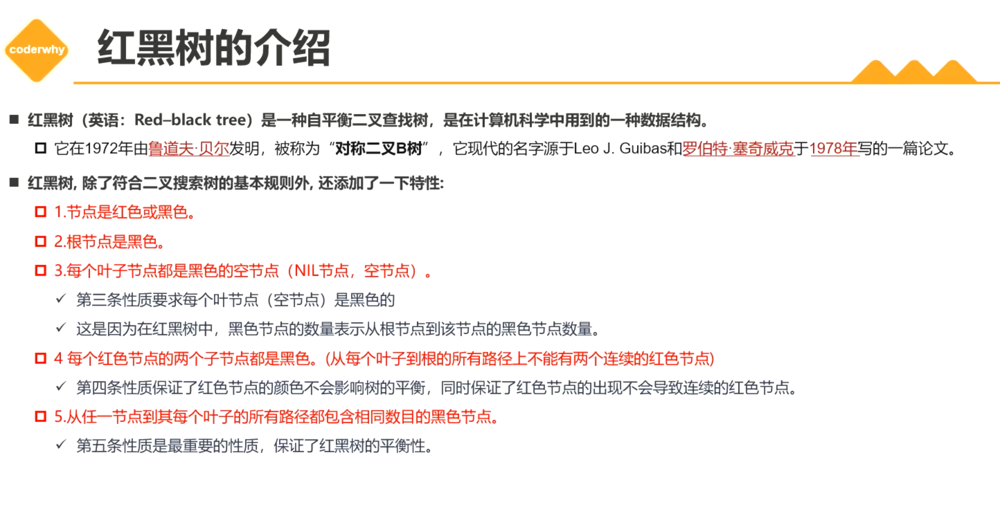

# 红黑树（Red-black tree）

+ 红黑树是一种自平衡二叉搜索树。最早叫对称二叉B树。
+ 红黑树除了符合二叉搜索树的基本规则外，还添加了一些特性：
  + 节点是红色或黑色（早期计算机显示颜色的原因选用黑色和红色，AVL树给每一个节点一个权值，RB树给每一个节点一个颜色）
  + 根节点是黑色
  + 每个叶子节点都是黑色的空节点（NIL节点，空节点）
    + 第三条性质要求每个叶子节点（空节点）是黑色的
    + 这是因为在红黑树中，黑色节点的数量表示从根节点到该节点的黑色节点数量
  + 每个红色节点的两个字节点都是黑色。（从每个叶子到根的所有路径上不能有两个连续的红色节点）

+ 为什么已经有平衡二叉树，还需要红黑树？

  

## x. 图包

## x1. 红黑树代码

 

 

