# 排序算法（Sorting algorithm）

+ V8用的就是归并排序和快速排序

+ JS底层大多用的是归并和快排

 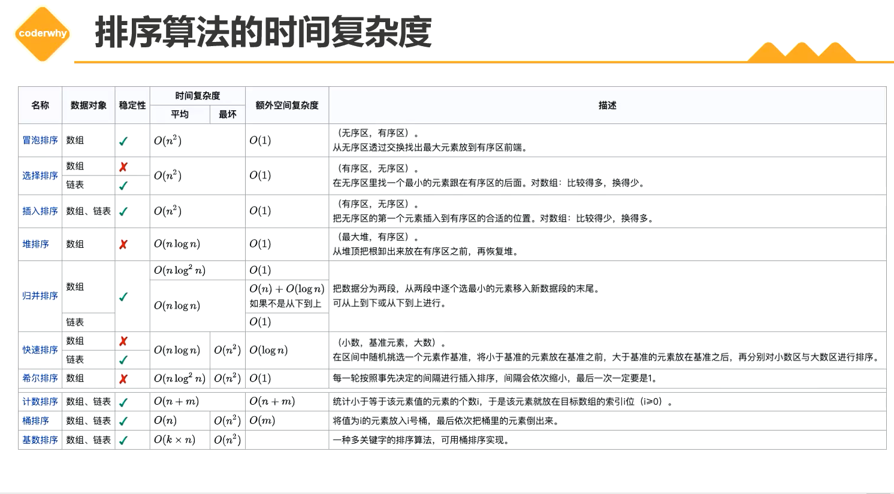

## 1. 冒泡排序（Bubble Sort）

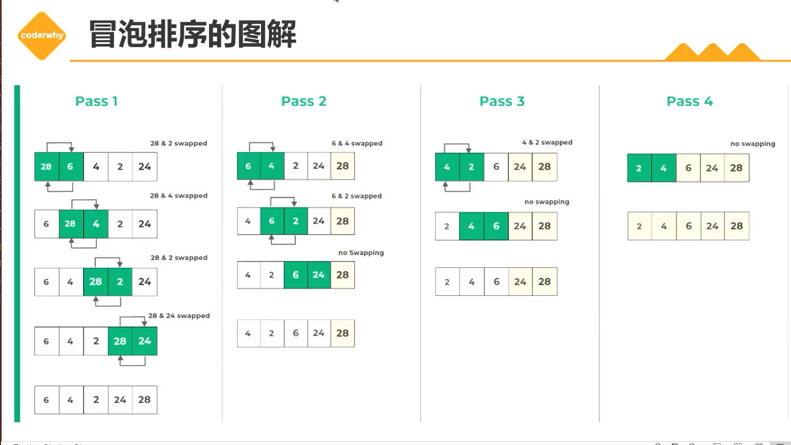

+ 时间复杂度：

  + 理想状态下。数组长度为n，只需要遍历一次，发现没有发生交换，说明已经排序好了，直接返回。那么循环实际执行了n-1次，那么时间复杂度推导为O(n)。交换的次数0次，交换操作时间复杂度为O(0)。

  + 最坏的情况，就是数组长度为n，里面的数据都是逆序的。需要进行n-1轮排序，每一轮中需要进行n-i-1次比较和交换操作。即 n^2^ - 2n + 1即O（n^2^）。

    交换次数O(n^2^)

  + 平均情况O(n^2^): 数据都是随机顺序的情况下，每一对元素的比较和交换都有1/2的概率打死，需要进行n-1轮排序，每一轮中需要进行n-i-1次比较和操作。

+ 冒泡排序的时间复杂度主要取决于数据的初始顺序。最坏的情况下，时间复杂度O(n^2^)，不适用于大规模数据的排序。

## 2. 选择排序（Selection Sort）

+ 选择排序（Selection Sort）是一种简单的排序算法。
+ 基本思想：
  + 首先在未排序的数列中找到最小（大）元素，然后将其存放到数列的起始位置。
  + 接着，再从剩余未排序的元素中继续寻找最小（大）元素，然后放到已排序序列的末尾
  + 以此类推，直到所有元素均排序完毕。
+ 选择排序中，比较次数仍然是n-1次，但是交换次数为1次。相对于冒泡排序上，优化了交换次数。
+ 时间复杂度：
  + 最好情况：数组本身是有序的，那么内循环每次都需要执行n-1-i次，因此比较次数n(n-1)/2，交换次数为0。所以时间复杂度为O(n^2^)。
  + 最坏情况: 数组是排序数组的倒序排序，内层循环都需要比较n-1-i次，因此比较次数为n(n-1)/2,交换次数也为n(n-1)/2。所以排序的时间复杂度为O(n^2^)
  + 平均情况时间复杂度：O(n^2^)

+ 时间复杂度的结论没错，但是分析有点问题，后面改。

## 3. 插入排序

+ 从小到大排序：一个数组中，我们假设第一个数据已经排序好（或者已经排序好的数据），后面的数据开始进行与向前进行比较，然后找到比他小的数的位置，然后后面的位置向后移动一个单位，数据插入到空出来的位置上。

## x. 图包

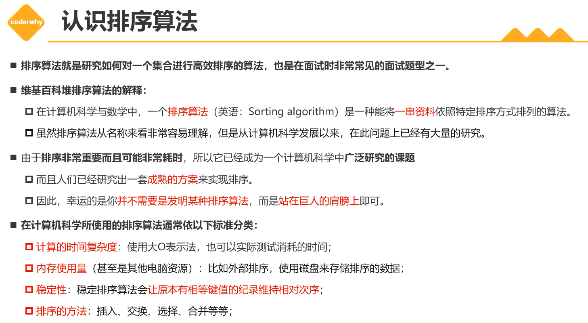

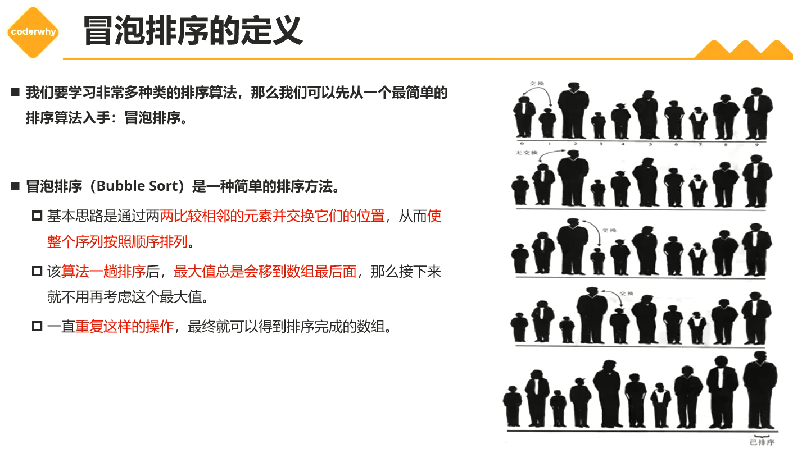

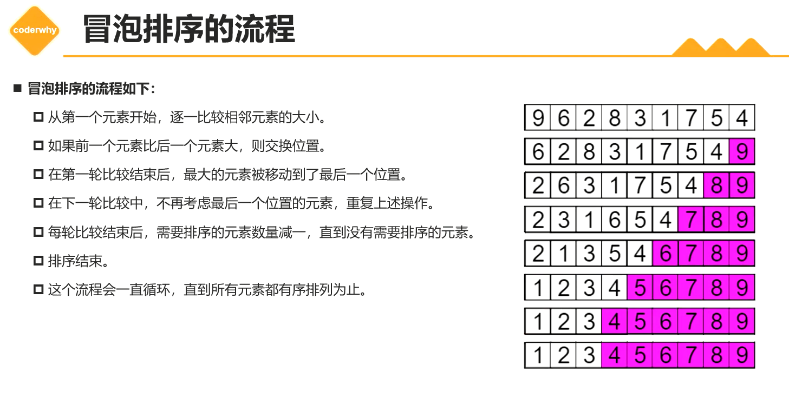

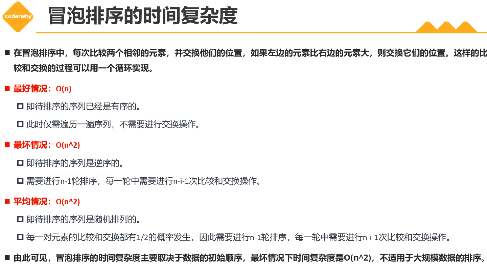

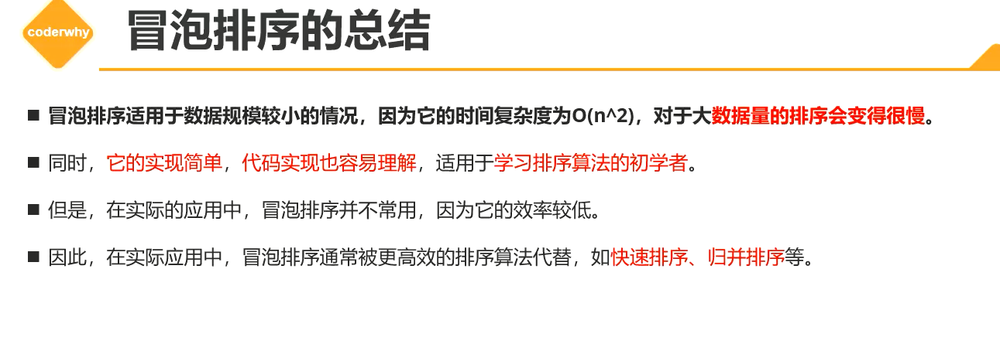

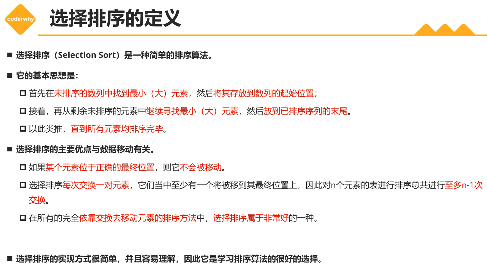

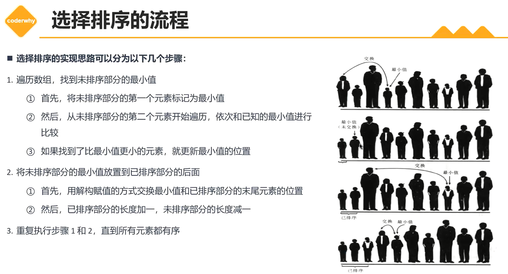

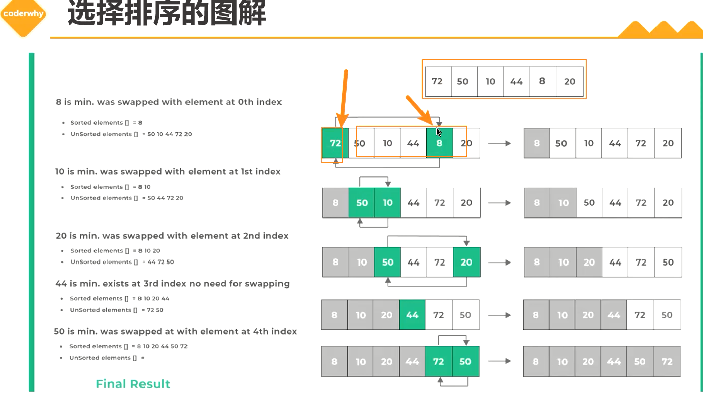

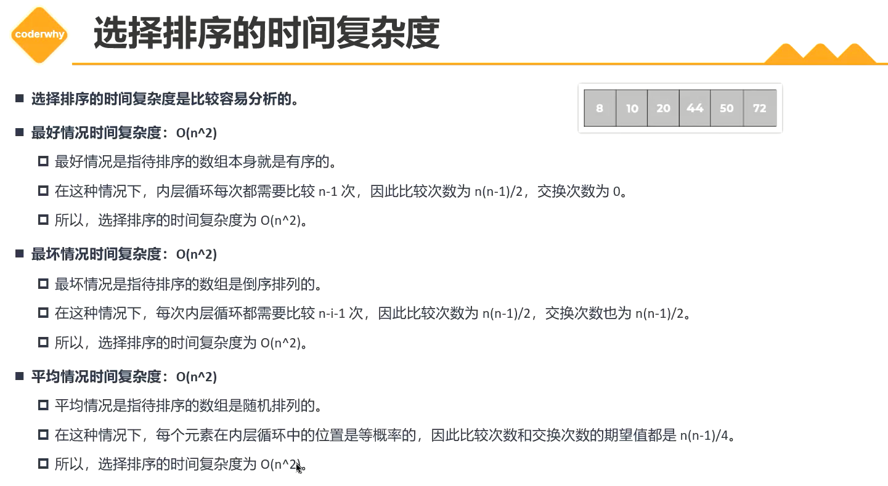

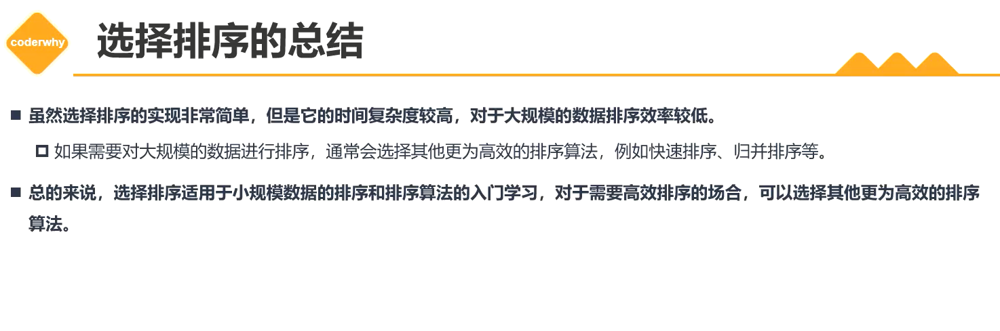

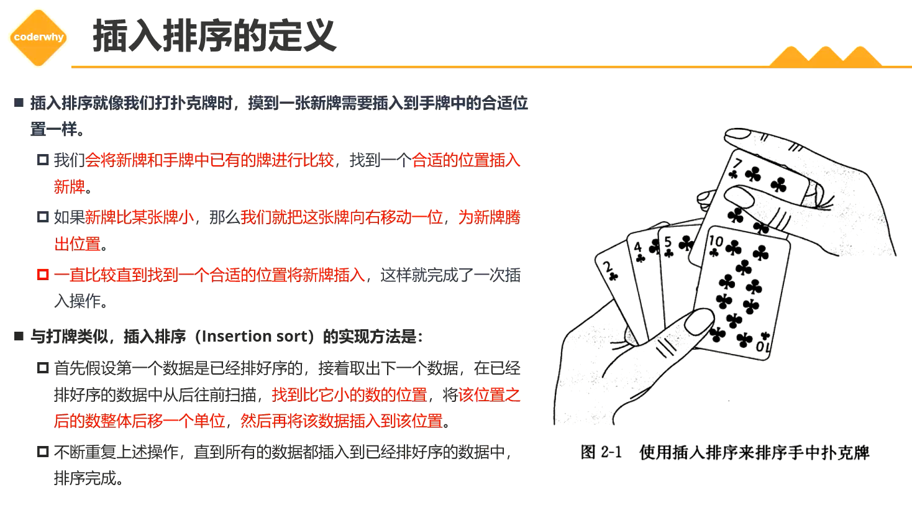

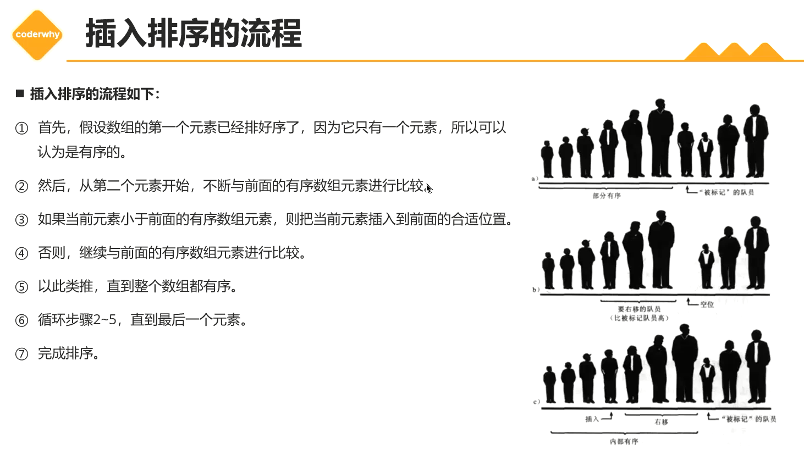

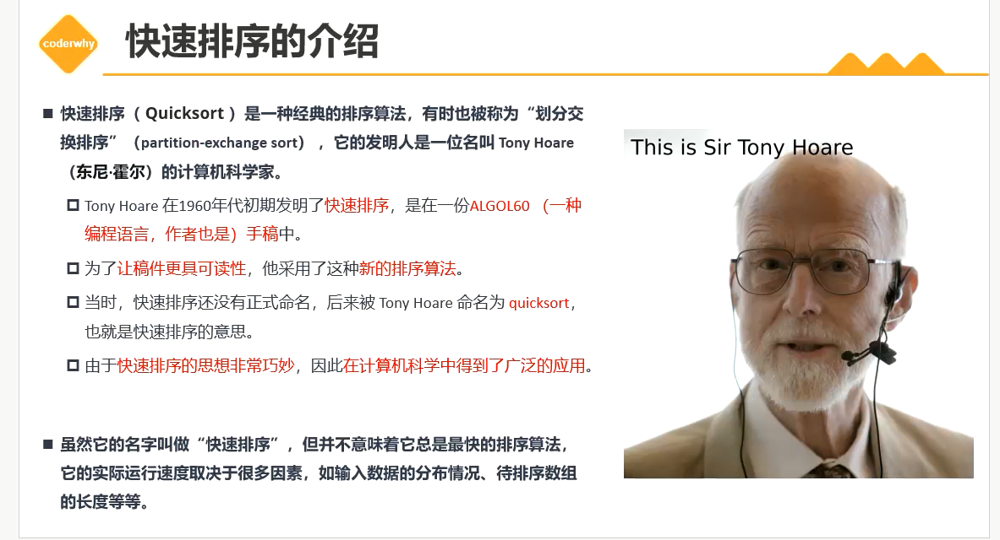