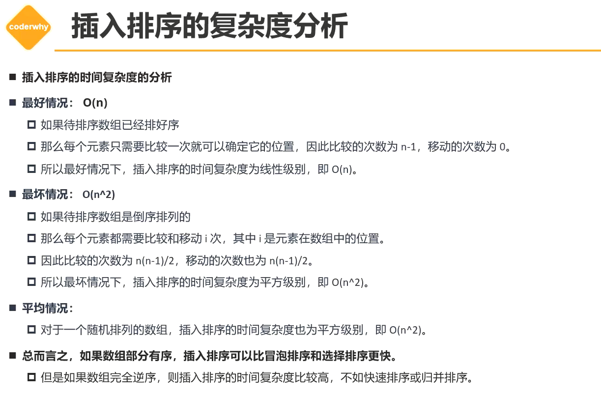
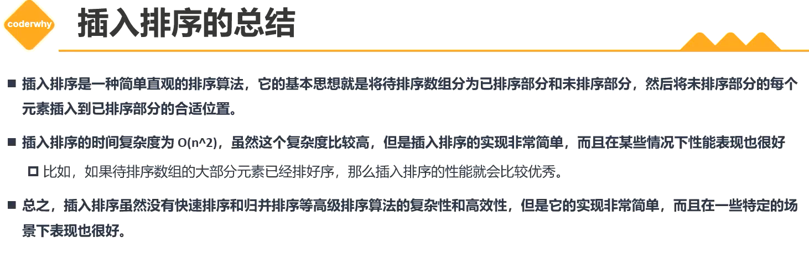
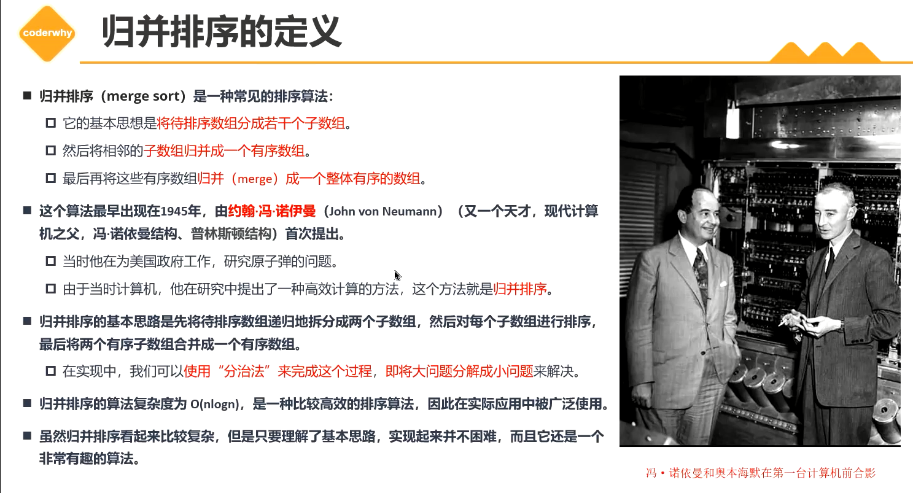
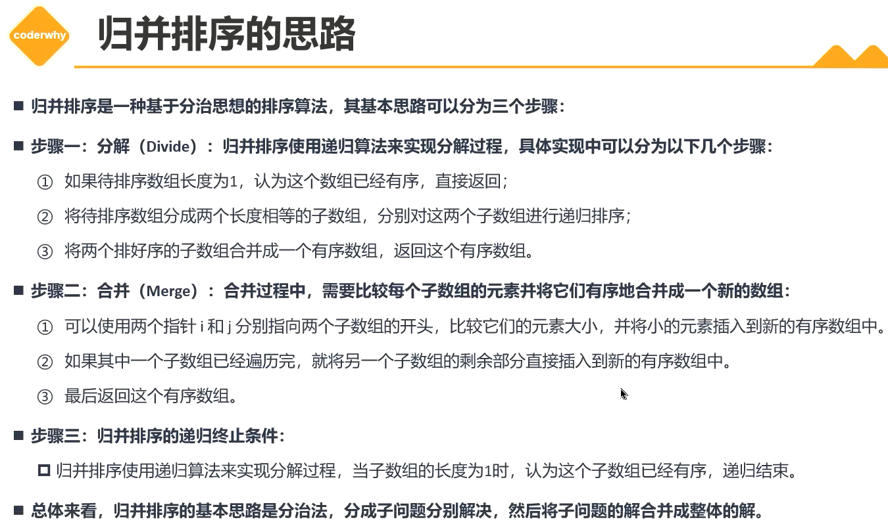
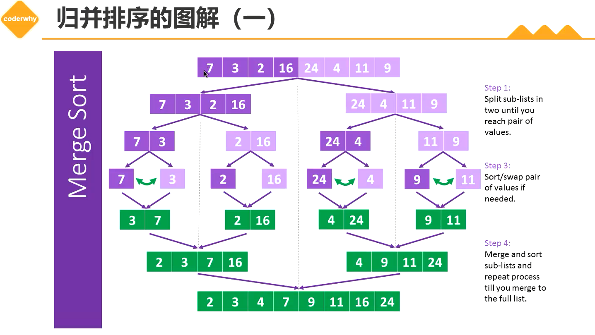
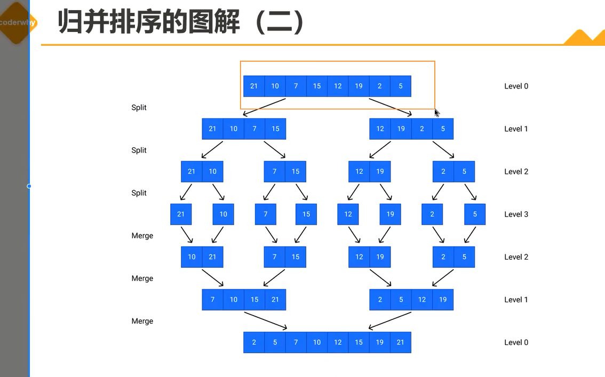

# 排序算法（Sorting algorithm）

+ V8用的就是归并排序和快速排序

+ JS底层大多用的是归并和快排

 

## 1. 冒泡排序（Bubble Sort）

+ 时间复杂度：

  + 理想状态下。数组长度为n，只需要遍历一次，发现没有发生交换，说明已经排序好了，直接返回。那么循环实际执行了n-1次，那么时间复杂度推导为O(n)。交换的次数0次，交换操作时间复杂度为O(0)。

  + 最坏的情况，就是数组长度为n，里面的数据都是逆序的。需要进行n-1轮排序，每一轮中需要进行n-i-1次比较和交换操作。即 n^2^ - 2n + 1即O（n^2^）。

    交换次数O(n^2^)

  + 平均情况O(n^2^): 数据都是随机顺序的情况下，每一对元素的比较和交换都有1/2的概率打死，需要进行n-1轮排序，每一轮中需要进行n-i-1次比较和操作。

+ 冒泡排序的时间复杂度主要取决于数据的初始顺序。最坏的情况下，时间复杂度O(n^2^)，不适用于大规模数据的排序。

## 2. 选择排序（Selection Sort）

+ 选择排序（Selection Sort）是一种简单的排序算法。
+ 基本思想：
  + 首先在未排序的数列中找到最小（大）元素，然后将其存放到数列的起始位置。
  + 接着，再从剩余未排序的元素中继续寻找最小（大）元素，然后放到已排序序列的末尾
  + 以此类推，直到所有元素均排序完毕。
+ 选择排序中，比较次数仍然是n-1次，但是交换次数为1次。相对于冒泡排序上，优化了交换次数。
+ 时间复杂度：
  + 最好情况：数组本身是有序的，那么内循环每次都需要执行n-1-i次，因此比较次数n(n-1)/2，交换次数为0。所以时间复杂度为O(n^2^)。
  + 最坏情况: 数组是排序数组的倒序排序，内层循环都需要比较n-1-i次，因此比较次数为n(n-1)/2,交换次数也为n(n-1)/2。所以排序的时间复杂度为O(n^2^)
  + 平均情况时间复杂度：O(n^2^)

+ 时间复杂度的结论没错，但是分析有点问题，后面改。

## 3. 插入排序（Insertion Sort）

+ 从小到大排序：一个数组中，我们假设第一个数据已经排序好（或者已经排序好的数据），后面的数据开始进行与向前进行比较，然后找到比他小的数的位置，然后后面的位置向后移动一个单位，数据插入到空出来的位置上。

+ 复杂度分析：
  + 最好的情况O(n): 如果数据已经排序好，那么每个元素只需要比较一次就可以确定位置，因此比较次数为n-1。移动次数为0。
  + 最坏的情况O(n^2^): 如果数据是倒序的，那么比较次数为n(n-1)/2,移动次数也为n(n-1)/2。那么插入倒序的时间复杂度为O(n^2^)
  + 平均情况就是O(n^2^)
+ 如果数组部分有序，插入排序可以比冒泡排序和选择排序更快。
  + 但是数组完全逆序，则插入排序的时间复杂度比较高，不如快速排序或归并排序。

+ 缺点：假如有一个数据特别大，且位置靠前，那么每次比较的时候，这个数据都要不断向后移动，比较浪费性能，反之，一个特别小的数据靠后，那么需要不断比较向前移动。
+ 优点：针对数据大部分已经排序好的数据来说，性能上比较优秀

## 4. 归并排序（merge sort）

+ V8引擎中就用到了归并排序。
+ 归并排序（merge sort）：
  + 它的基本思想是将待排序的数组分成若干个子数组。
  + 然后将想了的子数组归并成一个有序数组
  + 最后再将这些有序数组归并（merge）成一个整体有序的数组

+ 归并排序的基本思想是先将待排序数组递归地拆分成两个子数组，然后对每个子数组进行排序，最后将两个有序子数组合并成一个有序数组。
+ 归并排序的时间复杂度O(log n)

+ 思路：

  1. 分解（Divide）: 归并排序使用递归算法来实现分解过程。（一层一层对半分两个数组，然后一层层合并返回）
     + 如果待排序数组长度为1，认为这个数组已经有序，直接返回。
     + 将待排序数组分成两个长度相等的子数组，分别对这两个子数组进行递归排序；
     + 将两个排序好的子数组合并成一个有序数组，返回这个有序数组。

  2. 合并（Merge）: 合并过程中，需要比较每个子数组的元素并将它们有序地合并成一个新数组：
     + 可以使用两个指针i和j分别指向两个子数组的开头，比较它们元素的大小，并将小的元素插入到新的有序数组中
     + 如果其中一个子数组已经遍历完，就将另一个子数组的剩余部分直接插入到新的有序数组中。
     + 最后返回这个有序数组
  3. 归并排序的递归终止条件：
     + 归并排序使用递归算法来实现分解过程，当子数组的长度为1时，认为这个子数组已经有序，递归结束。（递归到最后，数组长度为1就不需要继续分解，排序也一定是有序的）

+ 总体来看，归并排序的基本思路是分治法，分成子问题分别解决，然后将子问题的解合并成整体的解。

+ 分解的次数为log n 次。

## x. 图包

