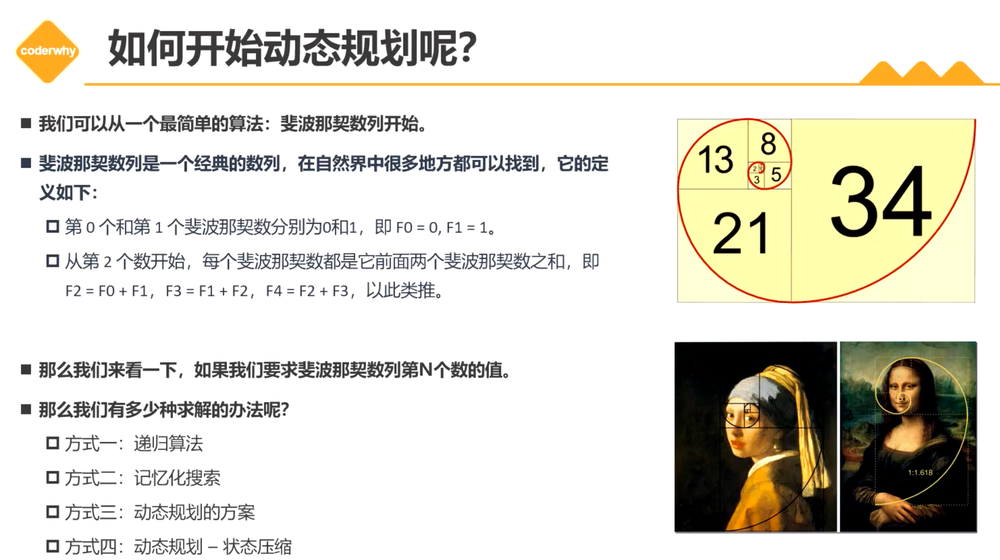

# 动态规划(Dynamic programming)

+ 动态规划(Dynamic programming DP)：通过把原问题分解为相对简单的子问题的方式求解复杂问题的方法。动态规划不是一种具体的方法，算是一种思想吧。
+ 动态规划：
  1. 定义状态
  2. 确定状态转移方程
  3. 初始状态
  4. 计算原问题的解(最终答案)

## 1. 斐波那契

  第0个和第1个为0和1，第2个开始值为前两个只和。

## 2. 爬楼梯(跳台阶)

## x. 图包

