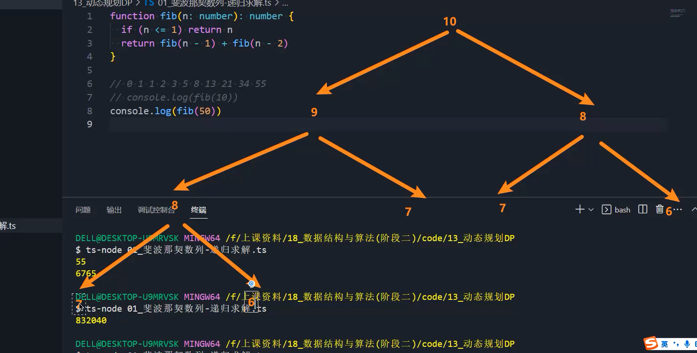
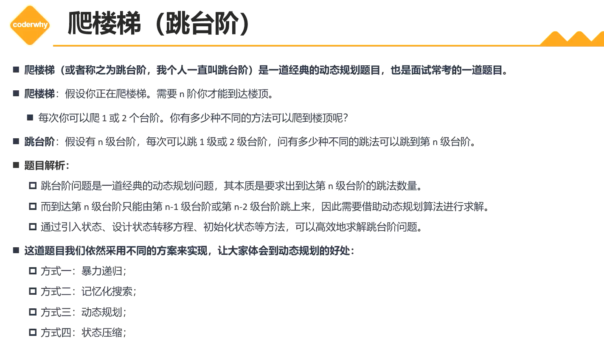

# 动态规划(Dynamic programming)

+ 动态规划(Dynamic programming DP)：通过把原问题分解为相对简单的子问题的方式求解复杂问题的方法。动态规划不是一种具体的方法，算是一种思想吧。（和归纳法的思想差不多）
+ 动态规划：
  1. 定义状态
     + 将原问题划分为诺干子问题，定义状态表示子问题的解，通常使用一个数组或者矩阵来表示。
  2. 确定状态转移方程
     + 计算子问题的基础上，逐步构建出原问题的解。
     + 这个过程通常使用-状态转移方程 来描述，表示从一个状态转移到另一个状态时的转移规则
     + 说人话就是，我有一个当前的问题的解是需要前面或者其他问题的解，其他问题解出来了，我也就解出来了。
  3. 初始状态
  4. 计算原问题的解(最终答案)

## 1. 斐波那契(黄金分割)

leetCode509

  第0个和第1个为0和1，第2个开始值为前两个只和。

+ 递归解法：

  + 递归算法的基本思想也是将大问题拆分成诺干个相似的小问题，然后通过解决这些小问题来解决整个大问题。
  + 当我们需要解决的问题，依赖上一层的解，上一层的解依赖上一层的时候，不断把当前解转移成上一层的方程，不断向上，最终找到初始状态，结束递归，然后依次返回，最终解决问题。

  + 递归地效率是非常低的，例如，当我们求解第10个数的值的时候，需要求解第9和第8，求解第9需要第8和第7，而求解第8需要第7和第6，这时候，不难发现，递归过程中存在大量的重复计算，这些都是非常消耗性能和效率的
  + 递归往往是自顶向下求解。

+ 记忆化搜索：
  + 对于递归算法，很容易出现重复计算的问题，因为在计算同一个子问题时，可能会被重复计算多次。
  + 为了避免这个问题，我们可以使用记忆化搜索(Memoization)的技巧，将已经计算过的结果保存下来，以便在后续的计算中直接使用。

## 2. 爬楼梯(跳台阶)

+ leetCode70

+ 每次你可以爬一个或两个台阶，到第n个，一共有几种方式。
+ 拆分问题来看，我们想要到达第n个台阶，只有两种方式，从n-1或n-2跳。那么n台阶的方法 = 到达n-1的方法 +  到达n-2的方法，那么状态转移方程就出现了
+ 这样子就拆分出子问题了，到n-1和n-2一共有几种方法
+ 台阶为1的话，只有一种

## 3. 买卖股票的最佳时机

+ leetCode121

## x. 图包

