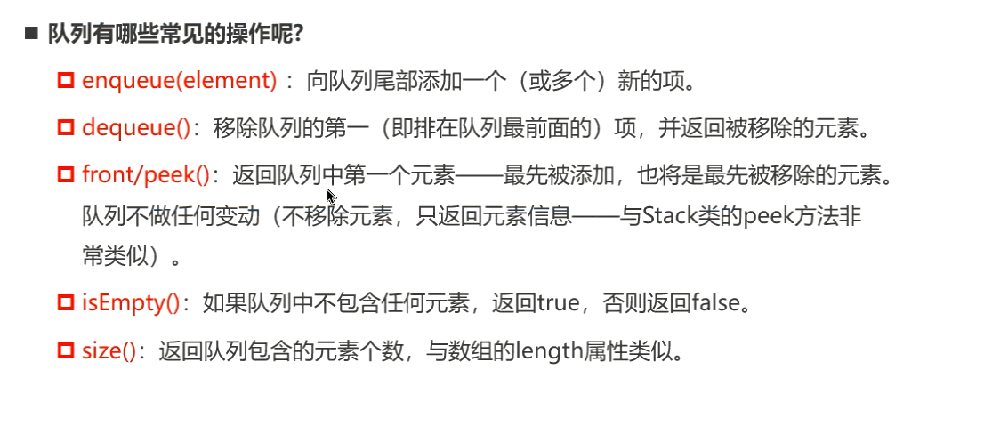
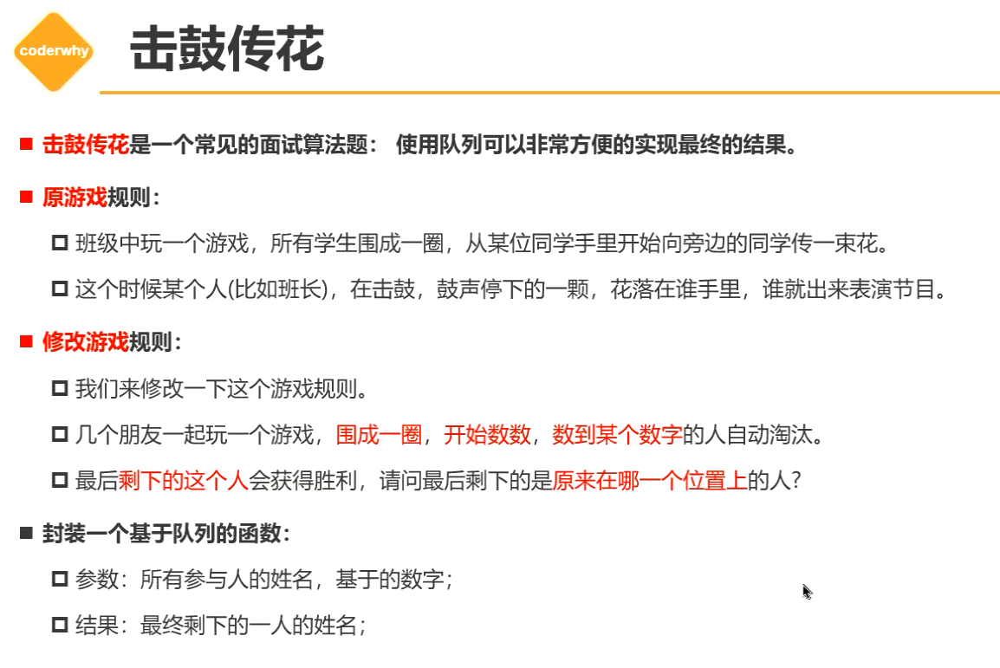
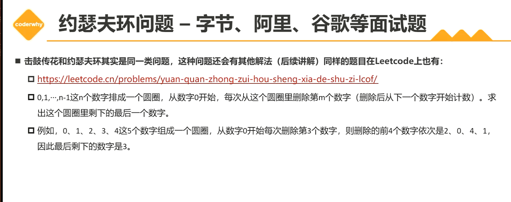

# 一. 队列结构(Queue)

+ 队列是一种受限的线性表，先进先出（FIFO First In First Out）
  + 受限之处在于它只允许在队列的顶端（front）进行删除操作；
  + 在队列的后端（rear）进行插入操作。
+ 遍历二叉树的时候通常使用队列来完成。

## 1. 队列的常见操作

`implements`来实现`interface`接口。

### 1.1 函数重载

函数重载: 一个作用域内存在多个相同的函数名，但是参数个数或参数类型等不相同，编译器会根据传递参数的类型推断使用哪一个函数。有点减轻程序员起名字负担。

## 2. 面试题: 击鼓传花

## 3. 面试题2: 约瑟夫环问题

