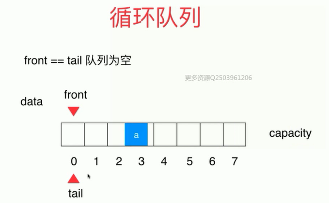
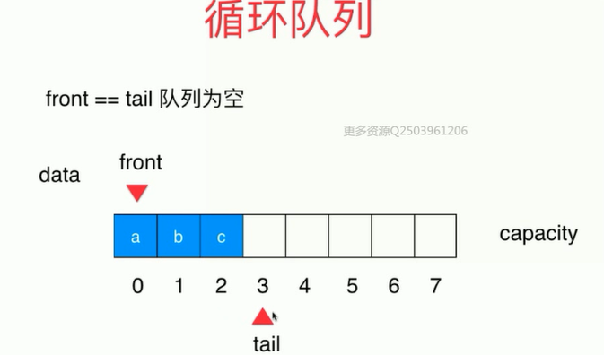
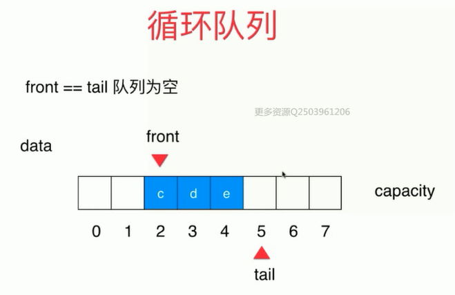
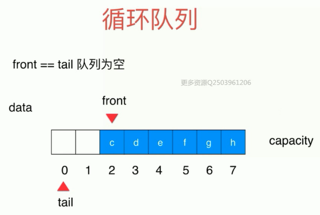
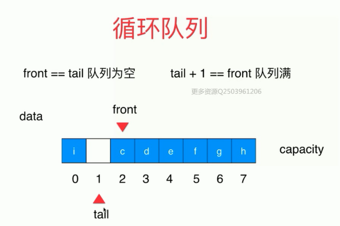

# 3. 栈和栈的应用

+ 线性数据结构：数组，栈(Stack)和队列(Queue)。
+ 相比数组，栈对应的操作是数组的子集。可以理解成被限制的数组。只能从一端（栈顶）添加元素，也只能从一端（栈顶）取出元素。
+ 栈是一种后进先出的数据结构。（Last In First Out LIFO）

+ 应用：撤销操纵，系统调用栈，括号匹配(Leetcode 20题) 

## 2. 队列 Queue

+ 相比数组，队列对应操作是数组的子集

+ 只能从一端（队尾）添加元素，只能从另一端（队首）取出元素。

+ 先进先出（First In First Out FIFO）

+ 队列可以使用数组实现，但是具有局限性就是当我们的删除队首元素的时候，数组剩下的元素需要向前挪一位，时间复杂度为O(n)，当数组足够大的时候，操作时间久。 

+ 通过循环队列解决这个问题：

  + front指针指向队首，tail指向最后一个元素的下一个位置。
  + 初始时队列为空，front和tail执行同一个位置，front === tail

  

  + 入队时，tail向后移动。

  

  + 出队时，front向后移动。

  

  +  循环队列，此时当tail为7的时候，继续入队，则tail为0，计算tail的方式为 `tail = 当前tail + 1 % 队列容积capacity`

  

  + 当出现`(tail + 1) % c=== front`的时候，意味着队列满。避免了tail === front表示队列满的情况，有意识浪费了一个空间，需要我们再次扩容。

  

  