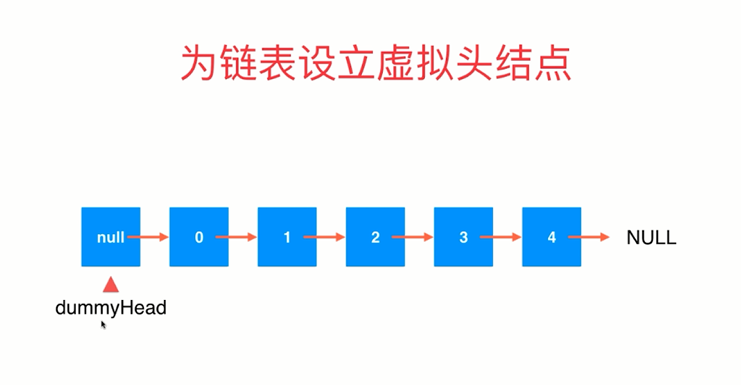

# 4. 链表（Linked List）

+ 线性数据结构 - 有序数据元素的集合。
  + 动态数组、栈、队列（本质都是静态数组，依靠resize方法解决固定容量问题）
  + 链表（真正的动态数据结构、最简单的动态数据结构、更深入的理解引用或指针）

+ 链表数据存储在节点（Node）中，这个节点通常有两部分的内容：
  + 存储真正的数据
  + Node.next指向当前节点的下一个节点。当指向的下一个节点为null，表示当前节点为最后一个节点。
  + 优点：真正的动态，不需要处理固定容量的问题。
  + 相对于数组确定是：丧失了随机访问的能力。（不能根据索引直接读取值）
    + 数组开辟的空间在内存里是连续分布的，可以计算数据位置的便宜。
    + 链表依靠next连接，内存中数据所在的位置并不一定连续的
    + 数组最好用于索引有语义的情况下，最大的优点：支持快速查询。
    + 链表不适合用于索引有语义的情况，最大的有点：动态

+ 在链表头添加元素

  ```js
  // 1. 当前添加元素为node。node.next指向当前链表head
  node.next = head
  
  // 2. 更新链表的head
  head = node
  ```

+ 在链表中间添加元素

  ```js
  // 查找我们要插入的位置prev
  // 插入元素node.next指向prev.next
  node.next = prev.next
  
  // prev.next更改
  prev.next = node
  ```

+ 为链表设立虚拟头节点（dummyHead）。（目的在于希望把插插入头节点的方法和其他插入方式统一起来）

  + 设置一个啥也不放的空节点作为链表头节点。有意识地浪费了一个空间。

  

  


