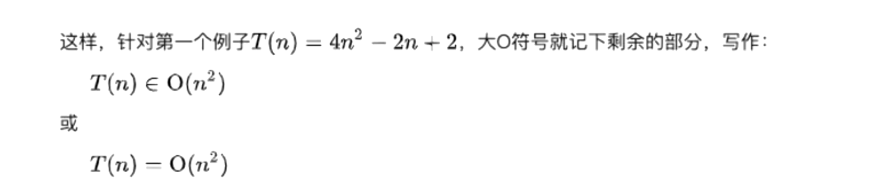

# 算法复杂度

## 1. 大O表示法(兰道符号)

+ 计算大O其实就是计算我们代码啊指令执行的次数，最后我们还会对计算出来的公式进行常量忽略。
+ 举个例子：解决一个规模为n的问题所话费的时间(或者所需步骤的数目)可以表示为: T(n) = 4n^2^ - 2n + 2
  + T(n)表示具体每一条指令执行结果
  + 当n增大时，n^2^项开始占据主导地位，其他各项可以忽略(省略后者对表达式的值的影响是可以忽略不计)。
    + 进一步看，n^2^的系数也是无关紧要的。
  + T(n)和O(n^2^)并不相等。
+ 算法具有n^2^阶(平方阶)的时间复杂度，表示为O(n^2^)



## 2. 大O表示法 - 常见的对数阶


## 3. 空间复杂度

+ 空间复杂度指的是程序运行过程中所需要的额外存储空间
  + 空间复杂度也可以用大O表示法来表示
  + 空间复杂度的计算方法与时间复杂度类似，通常需要分析程序中额外分配的内存空间，如数组，变量，对象，递归调用等(如果我是用的变量立马 销毁了，不会持续占据内存的一般忽略，具体情况分析)。
+ 例子：


## 4. 数组和链表的复杂度对比


+ 数组如果值都是有序的，甚至时间复杂度可以降到O(log n)级别
+ 图表中LinkedList的插入操作是O(1)级别，实际代码执行插入，需要执行查找，再插入，图中认为查找不能算入插入的行为。
+ 链表和数组都要对每一个数据分配空间，所以空间复杂度为O(n)


## 关于文件导入导出问题

```js
// 文件a
console.log('执行了a');

function a() {  }
console.log('执行了a');

setTimeout(() => {
  console.log('setTimeout中的a');
})

export default a;

console.log('执行了a');

```

```js
// 文件b
import a from './1.js';

console.log('执行了b');

function b() {}

export default b;
```

```js
// 文件c
import b from "./2.js";
import a from "./1.js";

console.log('执行了c');

```

```js
// 输出结果
执行了a
执行了a
执行了a
执行了b
3
```


+ 文件c中引入了文件b，然后文件b中引入了文件a。
+ js、ts文件在首次加载es module的时候，会走一遍初始化流程：
  + 模块内的同步代码会被执行一遍，执行c文件的时候，遇到了首次加载b模块，执行b模块，在b模块中遇到了加载a模块，这时候会把里面所有能够执行的代码执行一遍。所以打印了三次a，之后回到b文件同样把能执行的都执行一遍，得到了b。

+ 模块内的同步代码会被执行一遍，且会形成一个独立的作用域，导出产物都会挂载一个对象上
+ 当 模块 再次被 import 时，代码就不会执行了，直接返回导出产物
  + 所以再次导入a不会重复执行。
