#  哈希表(hashTable)

+ 哈希（散列，hashing）是电脑科学中一种对资料的处理方式，通过某种特定的函数/算法（哈希/散列 函数）对将要检索的项与用来检索的索引（哈希值）关联起来，生成一种便于搜索的数据结构（称之为哈希表）。
+ js对象就是通过哈希表实现的

## 1. 哈希表介绍和特性

+ 哈希表通常是基于**数组**进行实现的，但是相对于数组，它也很多的优势：
  + 它可以提供非常快速的插入-删除-查找操作
  + 无论多少数据,插入和删除值都接近常量的时间: 即O(1)的时间复杂度。实际上,只需要几个机器指令即可完成;
  + 哈希表的速度比树还要快,基本可以瞬间查找到想要的元素.
  + 哈希表相对于树来说编码(代码)要容易很多
+ 哈希表相对于数组的一些不足:
  + 哈希表中的数据是没有顺序的，所以不能以一种固定的方式(比如从小到大)来遍历其中的元素(没有特殊处理情况下)
  + **通常情况下,哈希表中的key是不允许重复的,不能放置相同的key,用于保存不同的元素**
    + 关于hashTable存放相同的key,这里的key就是我们要存放的字符串，理论上不允许出现重复的key，这样会产生歧义，也没有意义。
  + 事实上哈希表里存放的就是一个`key: value`的结构。

### 1. 哈希表到底是什么？

+ 它的结构是数组，但是神器的地方在于对数组的下标值的一种变换，这种变换我们可以使用哈希函数，通过哈希函数可以获取到HashCode。
  + 当我们有一组数据，存入哈希表中，通过哈希函数建立数据与索引的关系后，当查找数据的时候，由哈希函数求出索引再直接数组取值。
  + 数据库是一个应用程序。哈希表是一个数据结构。
+ 从上面不难发现，哈希表的建立，首要就是把数据和索引值建立联系，其次解决下标值重复的问题

+ 哈希值通常是一个数字或字符串，在计算机中是以二进制形式存储的。

### 2. 哈希表的一些概念

+ **哈希化**：将大数字转化成数组范围内下标的过程，我们就称之为哈希化。
+ **哈希函数**：通常我们会将单词转成大数字，大数字在进行哈希化的代码实现放在一个函数中，这个函数我们称为哈希函数。
+ **哈希表**：最终将数据插入到这个数组，对整个结构的封装，我妈就称之为一个哈希表。

### 3. 什么是冲突？

+ 不同的数据产生相同的下标值既是冲突。（冲突理论上必然存在）
+ 最常用到的有两种方式：**链地址法**和**开放地址法**

#### 1. 链地址法(拉链法)

+ 常用的方案
+ 从下面图片看出，链地址法解决冲突的办法是每个数组单元中存储的不再是单个数据，而是一个链条。
  + 这个链条可以是数组，链表，树等
  + 例如链表，每个数组单元中存储着一个链表。一旦发现重复，将重复的元素插入到链表的首端或末端即可。
  + 当查询时，先根据哈希化后的下标值找到对应的位置，再取出链表，依次查询找到数据。
+ 链条用数组还是链表呢？
  + 效率上差不多
  + 因为根据哈希化的index找出这个数组或者链表时，通常就会使用线性查找，这个时候两者效率差不多。

+ 链地址法是有缺点的，那就是如果一个链表或者数组的数据过多，查询效率就会下降，因为需要遍历链表或者数组。

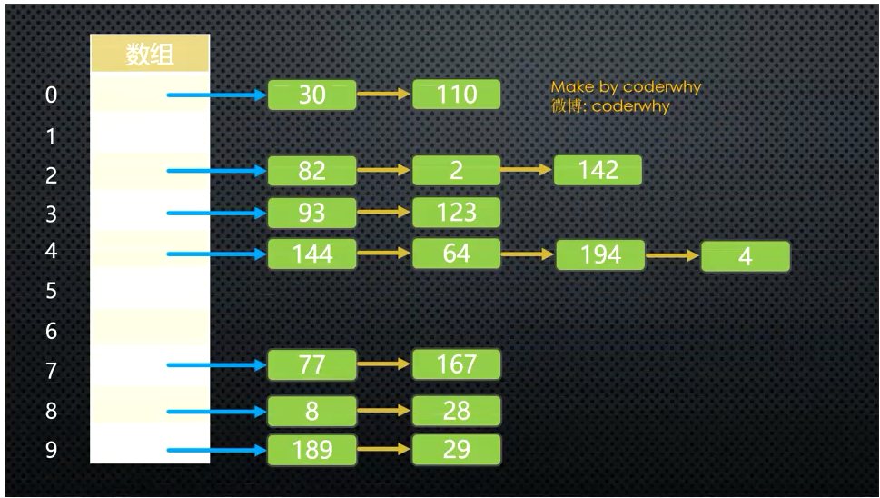

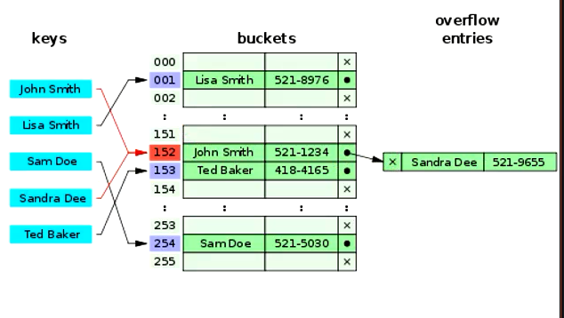

+ 上图用的是链表

#### 2. 开放地址法

+ 用的不多了

+ 开放地址法的主要工作方式是寻找空白的单元格来添加重复的数据。

+ 探索这个位置的三个：

  + 线性探测：
    + 线性的查找空白的单元，挨个+1找到空白的位置就插入。

  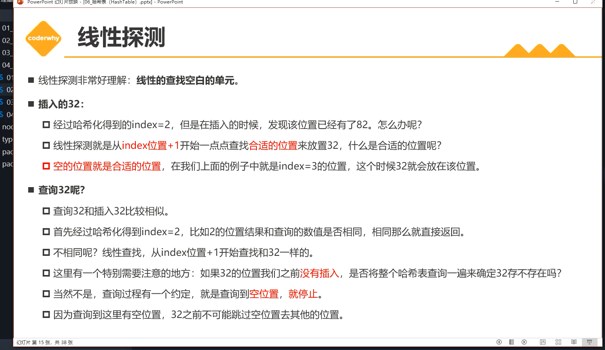

  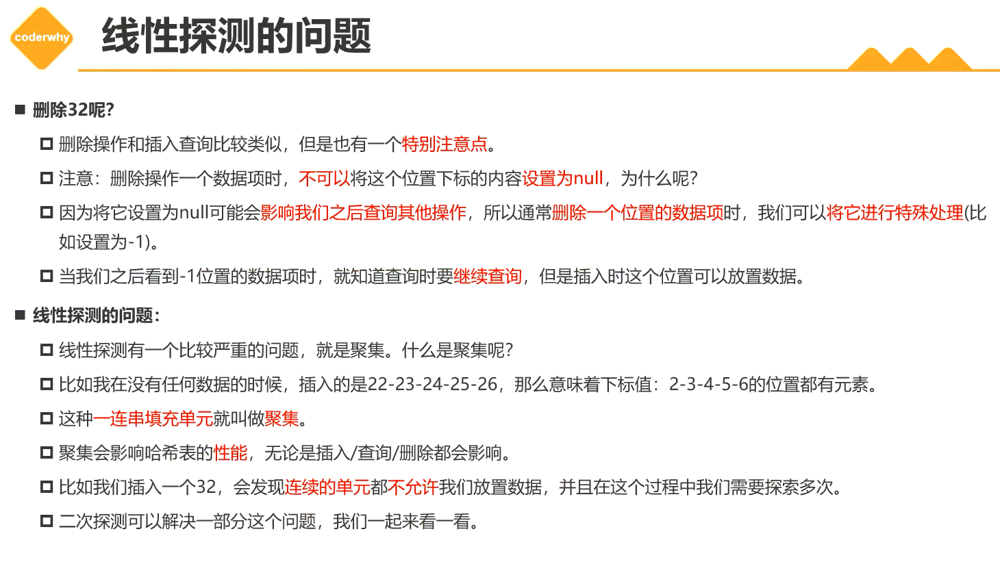

  + 二次探测

  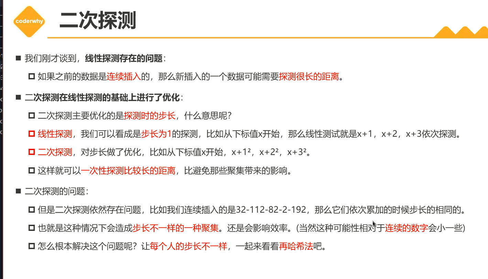

  + 再哈希法

  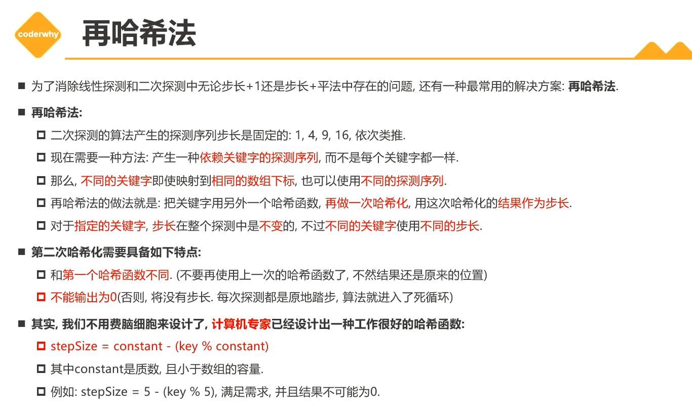

### 4. 哈希化效率

+ 哈希表中执行插入和搜索操作效率是非常高的 
  +  如果没有产生冲突，那么效率就会更高
  + 如果发生冲突，存取时间就依赖后来的探测长度。
  + 平均探测长度以及平均存取时间，取决于装填因子，随着装填因子变大，探测长度也越来越长。

  + 装填因子

    + 装填因子表示当前哈希表中已经包含的数据项和整个哈希表长度的比值。

    + 计算公式: 装填因子 = 总数据项 / 哈希表长度
    + 开放地址法的装填因子最大是多少呢？**1**，因为它必须寻找到空白的单元才能将元素放入。
    + 链地址法的装填因子呢?**可以大于1**，因为拉链法可以无限的延伸下去，只要你愿意。(当然后面效率就变低了）

  + 哈希表的查找效率与装填因子的大小是负相关的
    + 装填因子越大，查找效率越低
    + 所以当装填因子达到一个值时，我们就要对哈希表进行扩容以保证效率
    + 链地址法受填装因子的影响较小，大多数语言也采用此方法，所以我们就实现链地址法。

### 5. 了解一下

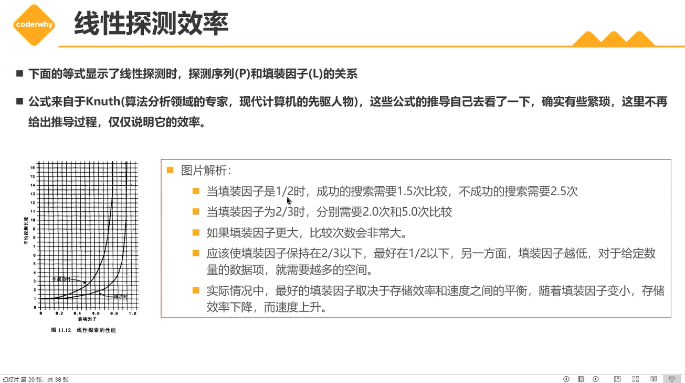

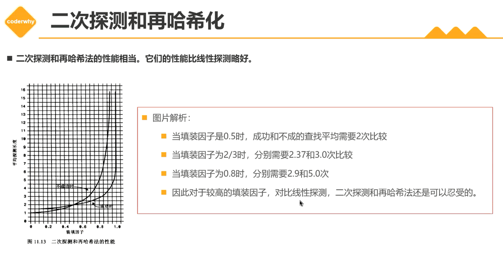

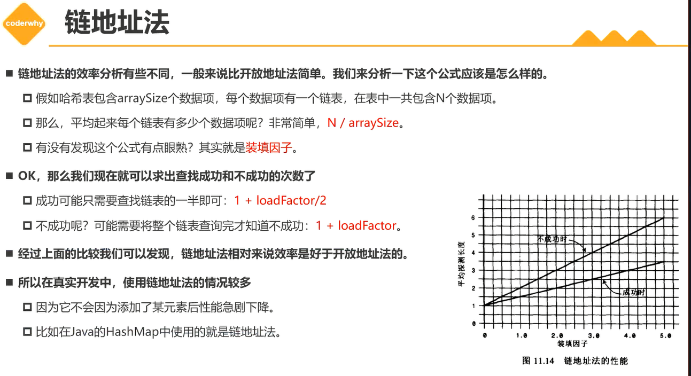

+ 查找成功，首先根据地址在数组中查找需要的时间为1，然后在数组保存的链表中查找继续查找，loadFactor即每个数组链表的平均长度，平均查找时间为它的一半，即最终所需要的平均时间为 1 + loadFactor/2

## 2. 哈希函数

+ 哈希表的主要优点是它的速度，提高速度的一个办法就是让哈希函数中尽量少的有乘法和除法。因为乘法和除法的性能比较低。如果哈希函数的性能不够，那么哈希表速度上不够快，就达不到设计的意义了。
+ 好的哈希函数具备的优点：
  + 快速的计算
    + 哈希表的优势就在于效率，所以快速获取到对应的hashCode非常重要
    + 我们需要通过快速计算获取到hashCode
  + 均匀分布
    + 哈希表中，无论是链地址法还是开放地址法，当多个元素映射到同一个位置的时候，都会影响效率
    + 优秀的哈希函数应该尽可能将元素映射到不同的位置，让元素在哈希表均匀的分布
+ 哈希函数可以有不同的设计方式，我们这里的设计主要有两步：
  1. 幂的连乘
  2. 取余操作

### 2.1 幂的连乘

+ 哈希函数可以有很多种设计方式，我们计划用字符串自己的字符编码想加，得到对应的hash值，但是同样的字符串可以有多种字符串组合，得到相同的hashCode。我们希望不同的字符串分布更均衡。

+ 当我们遇到一个大于10的数字，例如7654，可以用幂的连乘来表示它的唯一性：7654 = 7 * 10^3^ + 6 * 10^2^ + 5 * 10^1^ + 4 * 10^0^。同样的我们可以选择一个质数作为幂。来表示一个字符串的的幂的连乘。这样做并不意味着能解决冲突，但是减少了不同字符串生成相同的hashCode。

  不过这样做也有缺点，那就是幂的连乘会导致如果字符串很长，意味着下标值可以很大，那么意味着需要很大的数组。

### 2.1.1 下标的压缩算法

+ 我们决定用幂的连乘处理字符串，需要考虑压缩一下hashCode的长度。
+ 将巨大的整数范围压缩到可接受的数组范围。
+ 简单的办法就是进行取余操作，字符串转化的的数字 % 数组长度 = 新的下标值。这就完成了压缩。

### 2.2 快速计算：霍纳法则

+ 针对幂的连乘事实上我们还能够继续优化，一个好的哈希函数应该尽量减少乘除法的计算。
+ 优化方向就是霍纳法则。

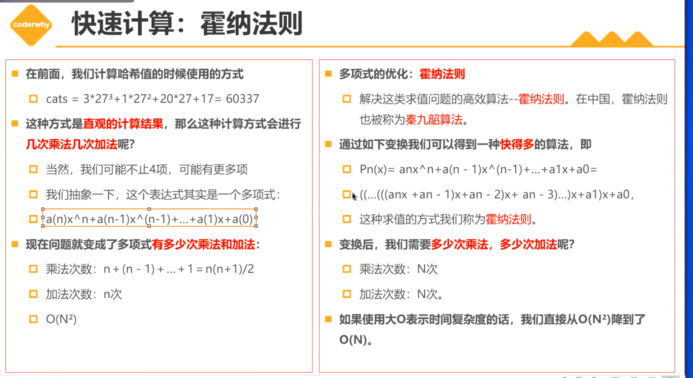

+ a(n) * x^n^中已经有n个乘法。通过计算所有项可以看出乘法的时间复杂度为 

  一共有n项加法，时间复杂度为O(n)。

  一共的时间复杂度 O(n^2^) + O(n)

  当n越大，事实上我们可以忽略影响小的项，最后O(n^2^)

+ 我们通过霍纳法则优化（秦九韶算法）

  + 每一项提取公因式

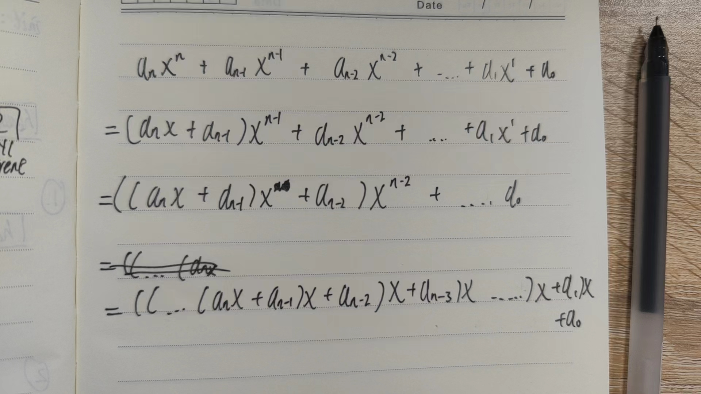

+ 通过数学方式优化之后，就是
+ 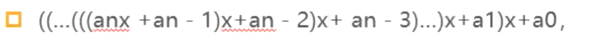
+ 不能看出乘法和加法都为O(n)，最终整个算法复杂度为O(n)。

分析上面的霍纳法则:

在我们的代码逻辑中，例如我有一个字符串abcd，那么a~0~表示最高项，意味着乘的幂是最多的，以abcd为例，数学中我们的n表示的项数个数，但在我们的代码中长度由0开始，所以最高项的指数为n-1。

a~0~X^3^ + a~1~X^2^ + a~2~X^3^ + a~3~X^4^

=> (((a~0~X + a~1~)X + a~2~)X + a~3~

这里我们最需要做的就是数学的公式转成代码的公式。

代码公式我们得到了，不难发现代码中我们要遍历一遍字符串，从0开始到3。其实有一个规律就是当我们执行到第n个的时候，所要做的就是，上一次计算的总和(这里可以记作上一次计算总和的hashCode)加上当前的第n项的值。

即 hashCode * X + string[n]

完成上面的分析后，我们的哈希函数就完成了

```ts
function hashFunc(key: string, max: number): number {
  // 1. 计算hashCode cats => 60337 (27为底的时候)
  let hashCode = 0;

  const length = key.length;
  for (let i = 0; i < length; i++) {
    // 霍纳法则计算hashCode

    // charCodeAt获取UTF16编码格式
    // 31就是我们霍纳法则的X,是我们选择的幂
    hashCode = 31 * hashCode + key.charCodeAt(i);
  }

  // 取模运算/取余运算
  const index = hashCode % max;
  return index;
}
```

+ 

### 2.3 优化

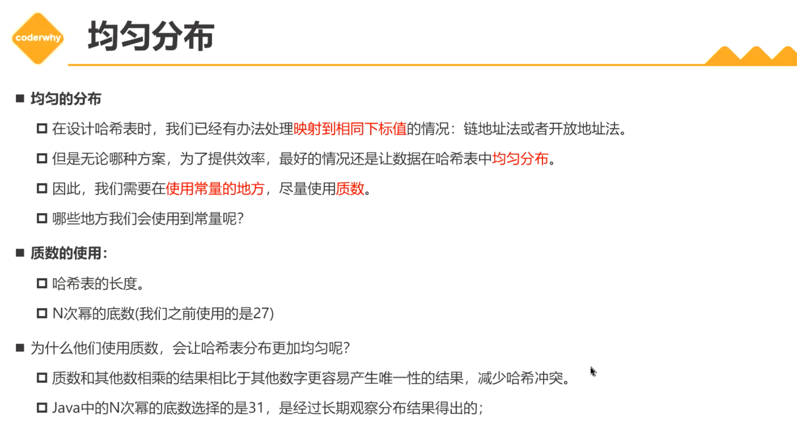

+ 使用质数有利于让数据分布更均匀，java中使用的是31
+ 哈希表的长度
+ N次幂的底数

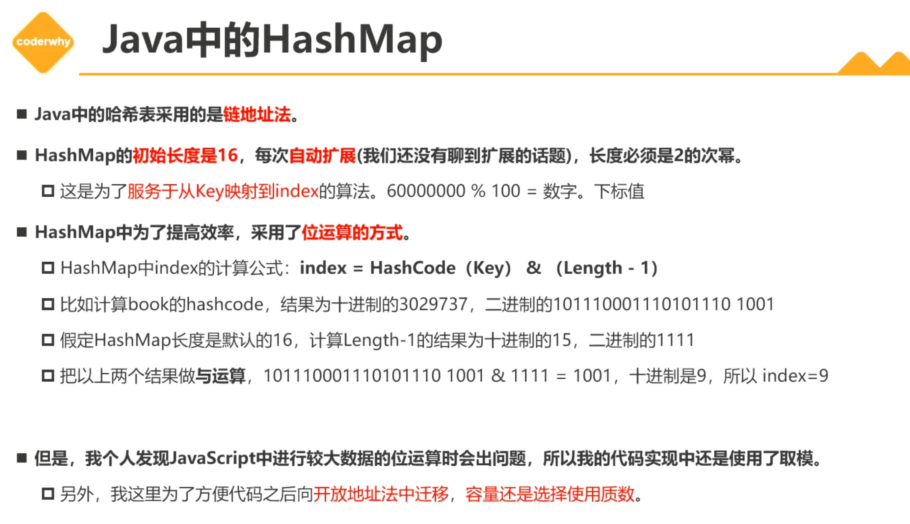

+ java中hashMap的长度为16，即0-15，刚好15的二进制为1111，方便**与运算**。

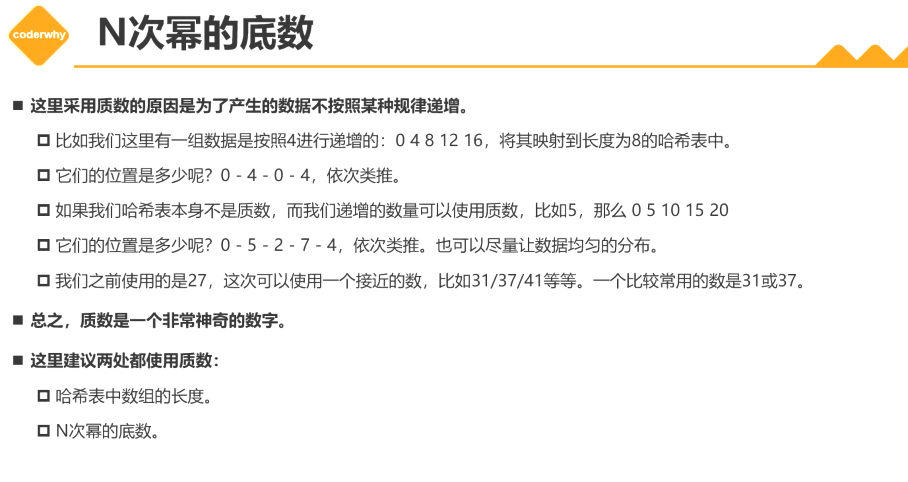

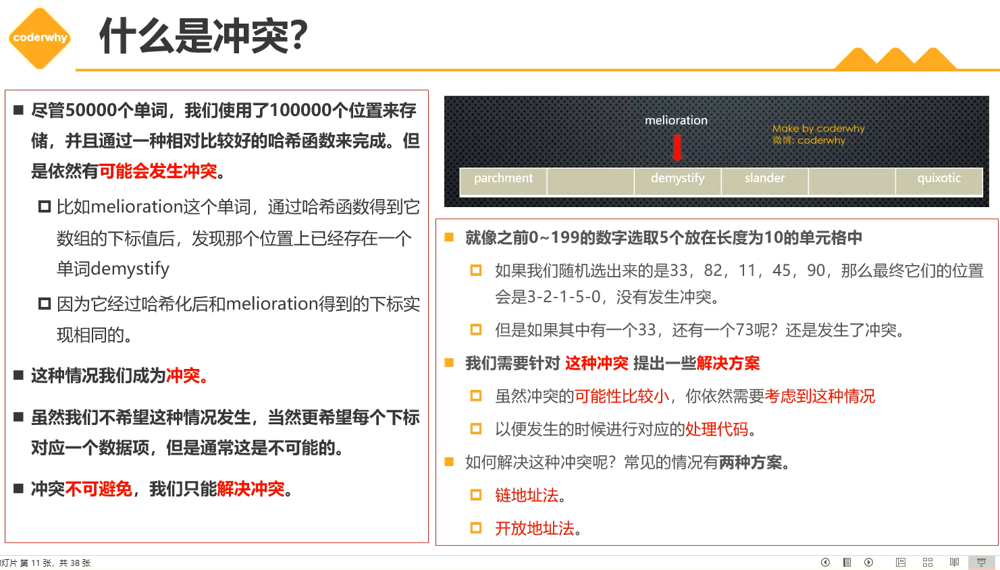

## 3. 哈希表的实现

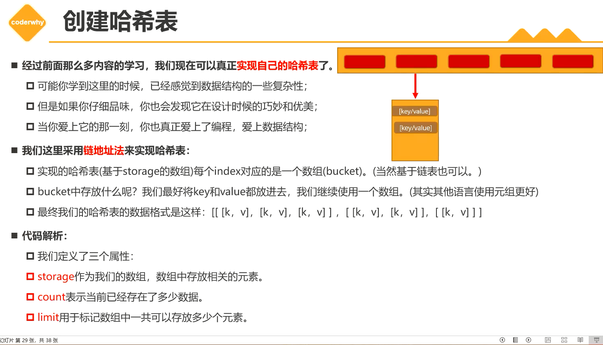

+ 哈希表本质上是一个数组(记为storage: 存储)
+ 链地址法：链指的是链条，即我们每个storage数组中存放对应一个数组（bucket：桶）或链表。这次我们实现采用数组
+ bucket数组存放的是键值对，key和value。形式[key,value]

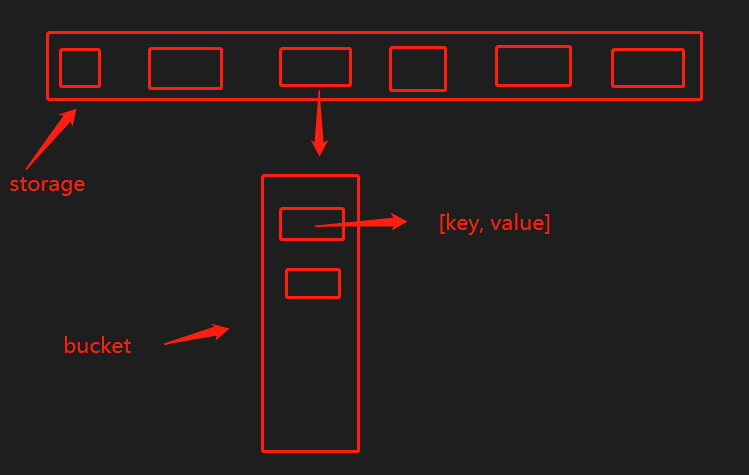

+ 哈希表中，我们需要定义三个属性
  + storage作为我们的哈希表基本数组
  + count表示存放元素
  + limit表示容量
+ 不难发现我们的哈希表是一个数组，最外层称之为storage，里面每一项保存数组bucket，bucket里面保存的是一个元组数据tuple  [key,value]
+ 不难发现我们的js对象就是用哈希表实现的，所以对象所拥有的方法哈希表都会有，只是方法名称等关键字不同

### 3.1 插入&修改数据

+ 哈希表中的key是不能重复的，当我们对哈希表存入一个key，假如key不存在，可以直接存入，存在则是对它进行了修改
+ 一开始我们的storage每一项存放的是一个undefined。所以获取的时候记得判断bucket是否为undefined
+ 当我们存入以后，storage存放的数组位置，保存的就是bucket的索引地址

### 3.2 获取数据

### 3.3 删除数据

### 3.4 扩容

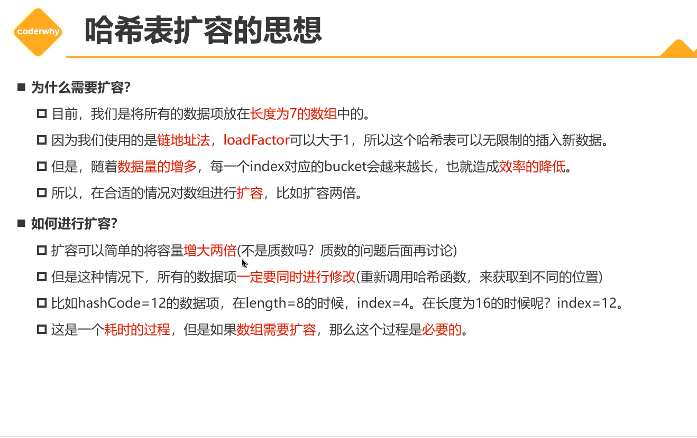


数据的哈希化过程


地址冲突解决方案


哈希函数代码实现


哈希表创建和操作


哈希表的自动扩容

 

## 7. 拓展

js对象用的就是哈希表实现的，js中变量分为基本类型和引用类型，分别对应着两种不同的存储方式-栈存储和堆存储。

+ 对象相等，hashCode一定相等，hashCode相等对象不一定相等。

## 8. 设计hash函数的PPT

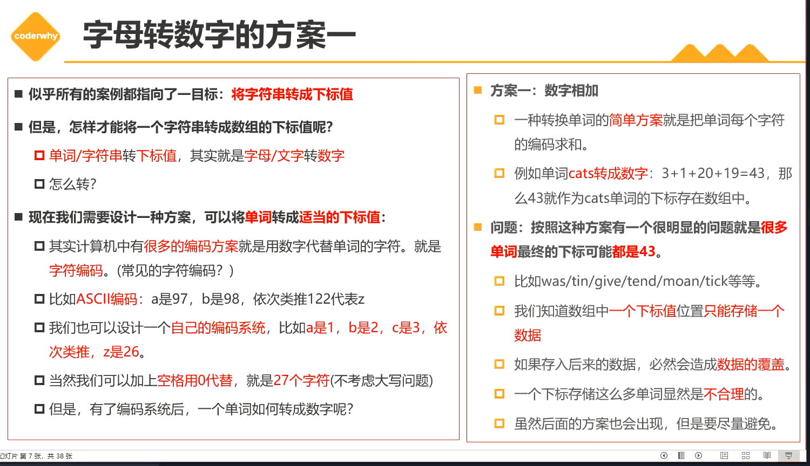

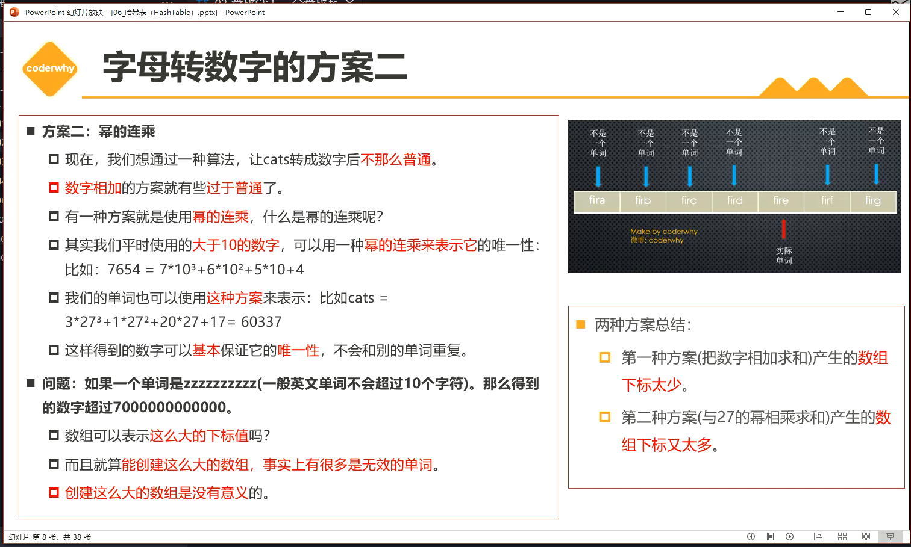

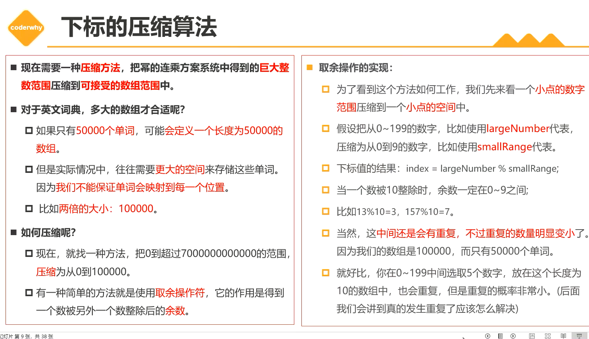


