# 树结构(Tree)

+ 树是非线性结构

+ 认识树结构以及特性
+ 树结构的优点和术语
+ 树结构常见的表示方法
+ 二叉树特性以及概念
+ 二叉树常见存储方式
+ 认识二叉搜索树特性
+ 二叉搜索树的封装
+ 二叉搜索树插入操作
+ 先序遍历、中序遍历
+ 后续遍历、层序遍历
+ 二叉搜索树 搜索操作
+ 二叉搜索树删除操作

## 1. 树的优点

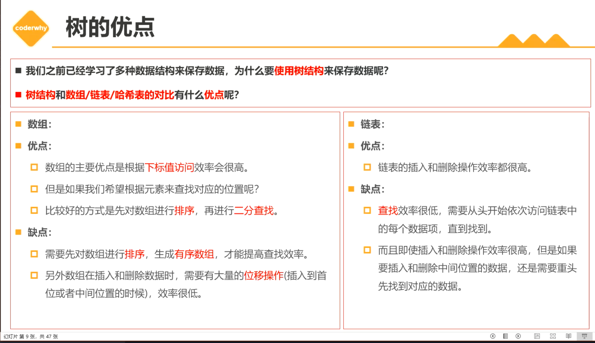

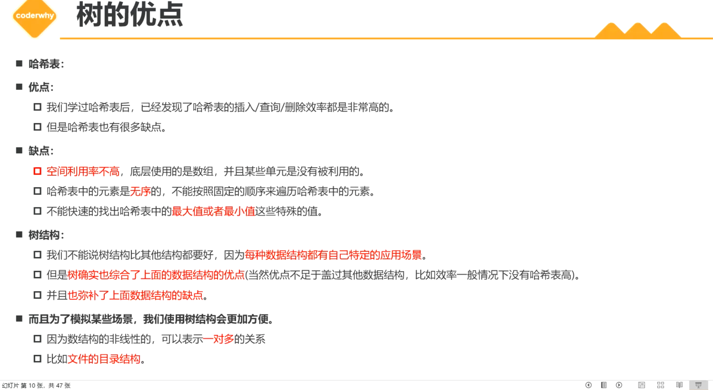


## 2. 树的术语

+ 树（Tree）: n（n > = 0）个节点构成的有限集合。
  + 当n=0时，成为空树
+ 对于任一颗非空树（n > 0）,它具备以下性质：
  + 树中有一个称为 **根（Root）**的特殊节点，用 **r** 表示；
  + 其余节点可分为m（m > 0）个互不相交的有限集T1，T2，......，Tm，其中每个合集本身又是一棵树，称为原来树的 **子树（subTree）**

1. **节点的度（Degree）**：一个节点含有的子树的个数称为该节点的度；
   + 一个节点含有的子节点的个数称为该节点的度；
2. **树的度（Degree of Tree）**：一棵树中，最大的节点度称为树的度；
3. **叶节点（Leaf）**或**终端节点**：度为零的节点；
4. **非终端节点**或**分支节点**：度不为零的节点；
5. **父亲节点**或**父节点（Parent）**：若一个节点含有子节点，则这个节点称为其子节点的父节点；
6. **孩子节点**或**子节点（Child）**：一个节点含有的子树的根节点称为该节点的子节点；
7. **兄弟节点（Sibling）**：具有相同父节点的节点互称为兄弟节点；
8. 节点的**层次**：从根开始定义起，根为第1层，根的子节点为第2层，以此类推；
9. **深度**：对于任意节点n,n的深度为从根到n的唯一路径长，根的深度为0；
   + **深度指的就是节点到根的距离**
10. **高度**：对于任意节点n,n的高度为从n到一片树叶的最长路径长，所有树叶的高度为0；
    + **高度是指节点到叶子结点的距离**
11. **堂兄弟节点**：父节点在同一层的节点互为堂兄弟；
12. **节点的祖先**：从根到该节点所经分支上的所有节点；
13. **子孙**：以某节点为根的子树中任一节点都称为该节点的子孙。
14. **森林**：由m（m>=0）棵互不相交的树的集合称为森林；
15. 路径和路径长度：从节点n1到nk的路径为一个节点序列n1，n2，......,nk
    + 路径长度计算有硬性规定：ni必须是n(i+1)的父节点。
    + 意味着ni节点只能往下走，走它的子节点，而不能向上走它的父节点。相当于路径的计算从起始节点ni开始，只能像瀑布一样从上往下，不能回走或者回爬。
    + 路径所包含边的个数为路径的长度。

## 3. 树的种类

+ 无序树：树中任意节点的子节点之间没有顺序关系，这种树称为无序树，也称为自由树。

+ 有序树：树中任意节点的子节点之间有顺序关系，这种树称为有序树；

  - 二叉树

    ：每个节点最多含有两个子树的树称为二叉树；

    - 完全二叉树：对于一棵二叉树，假设其深度为d（d>1）。除了第d层外，其它各层的节点数目均已达最大值，且第d层所有节点从左向右连续地紧密排列，这样的二叉树被称为完全二叉树；
      - [满二叉树](https://zh.wikipedia.org/wiki/满二叉树)：所有叶节点都在最底层的完全二叉树；
    - [平衡二叉树](https://zh.wikipedia.org/wiki/平衡二叉树)（[AVL树](https://zh.wikipedia.org/wiki/AVL树)）：当且仅当任何节点的两棵子树的高度差不大于1的二叉树；
    - [排序二叉树](https://zh.wikipedia.org/wiki/排序二元樹)([二叉查找树](https://zh.wikipedia.org/wiki/二叉查找树)（英语：Binary Search Tree))：也称二叉搜索树、有序二叉树；

  - [霍夫曼树](https://zh.wikipedia.org/wiki/霍夫曼树)：[带权路径](https://zh.wikipedia.org/w/index.php?title=带权路径&action=edit&redlink=1)最短的二叉树称为哈夫曼树或最优二叉树；

  - [B树](https://zh.wikipedia.org/wiki/B树)：一种对读写操作进行优化的自平衡的二叉查找树，能够保持数据有序，拥有多于两个子树。

## 4. 树的表示方式

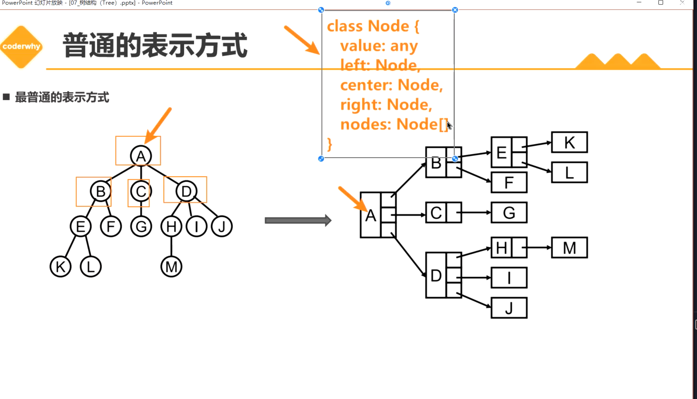

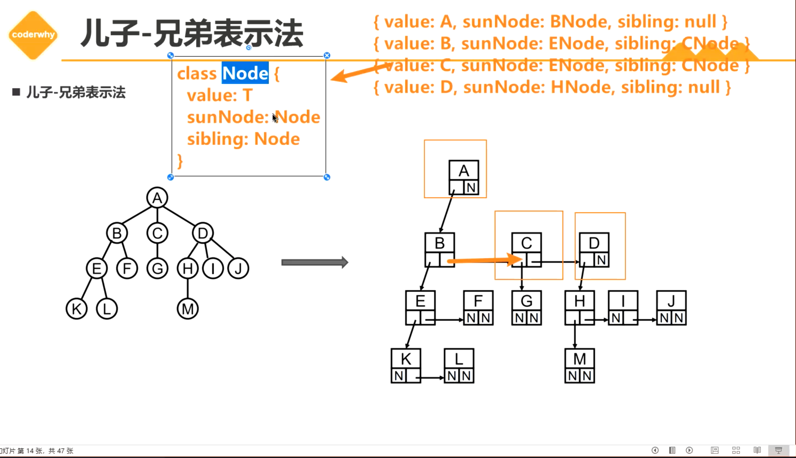

+ 兄弟表示法对比普通方式，就是抽取Node类型更加简单点。无论什么位置的node，你只要保存两个Node类型就行，而Node类型有两个节点，一个表示子节点，一个表示兄弟节点。相比普通方式Node的类型更固定

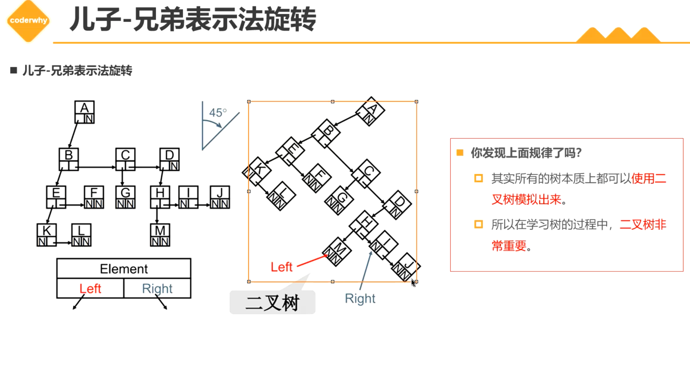

+ 以K为父节点，可以看出可以变成二叉树。从上面可以看出，任何的树都可以用二叉树表示出来。

## 5. 二叉树

### 5.1 二叉树的概念 

+ 如果树中每个节点最多只能有两个子节点，这样树就称为**二叉树**
  + 几乎所有的树都可以表示成二叉树形式

+ 二叉树的定义
  + 二叉树可以为空，也就是没有节点
  + 若不为空，则它由根节点和其 左子树（TL）和右子树（TR）的两个不相交的二叉树组成。

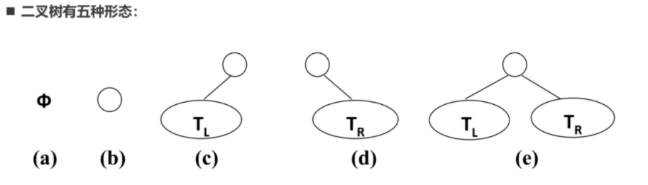

### 5.2 二叉树的特性

+ 一棵二叉树第 i（i > = 1） 层的最大节点数为 2^(i-1)^
  + 分析：每一层的最大节点数 1 - 2 - 4 - 8 - 16 - …… - 2^(i-1)^
+ 深度为k（k > = 1）的二叉树有最大节点总数为：
  + 分析：每增加一层，最大节点总数变化： 1 - 3 - 7 - 15- ...... - 2^k^ -1
+ 对任何非空二叉树T，若n0表示叶节点的个数，n2是度为2的非节点个数，那么满足关系n0 = n2 + 1
  + 分析：叶节点数量 = 度为2的节点树 + 1

### 5.3 完美二叉树

+ 完美二叉树（Perfect Binary Tree），也称为满二叉树（Full Binary Tree）
  + 在二叉树中，除了最下层的叶节点外，每层节点都有2个子节点，就构成了满二叉树。
  + 堆的特点就是一个完美二叉树

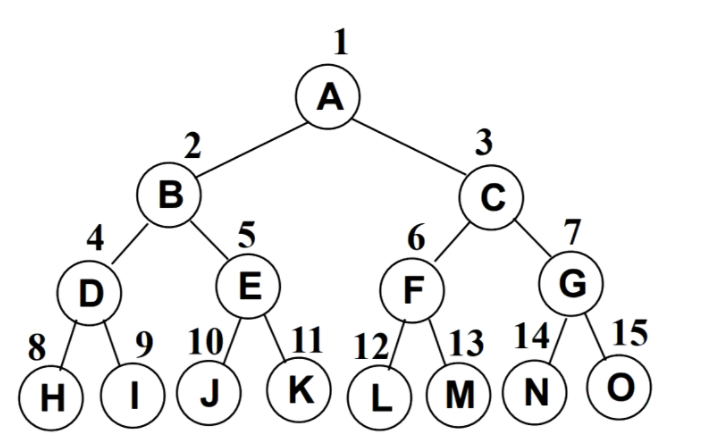

### 5.4 完全二叉树（Complete Binary Tree）

+ 区别：完全二叉树和完美二叉树是不一样的
+ 完美二叉树是完全二叉树的特殊形态，即除了叶子结点，其他结点都有两个子节点。

+ 完全二叉树从根节点到倒数第二层满足完美二叉树，最后一层可以不完全填充子节点，但是叶子结点都必须靠左连续对齐（就是叶子结点中间不能有空）例如下图：
+ H和J之前不是连续的

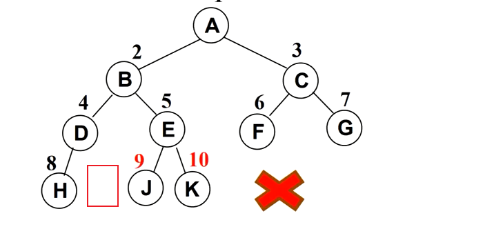

### 5.5 二叉树的存储

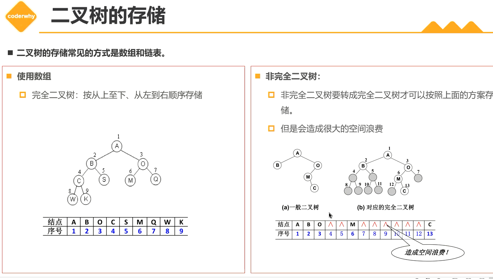

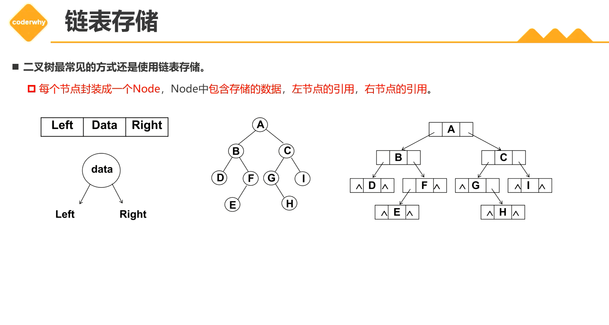

### 5.6 二叉搜索树

+ 二叉搜索树（BST，Binary Search Tree），也称为二叉排序树或二叉查找树
+ 二叉搜索树是一棵二叉树，可以为空
+ 如果不为空，二叉搜索树满足一下性质：
  + 非空左子树（即存在左子树）的所有键值小于其根节点的键值
  + 非空右子树的所有键值大于其根节点的键值。
+ 二叉搜索树的特点：
  + 二叉搜索树的特点就是相对根节点较小的值总是保存在左节点上，相对较大的值总是保存在右结点上。
  + 这样的特点，查找效率更高。
+ 当我们要查找一个节点的时候，查找的方式和二分查找相似，每次找到中间值然后进行下一步，所以**树的查找最大次数等于二叉搜索树的深度**
+ 插入节点时，也是类似二分查找的方式，一层层比较。
+ 题外话：根据上面的查找方式不难推测如何构建一个二叉搜索树。如果对数据排序，然后找到中间值分左子树的数据组和右子树的数据组，然后不断给左节点右结点找到数据的中间。

## 6 二叉搜索树的封装

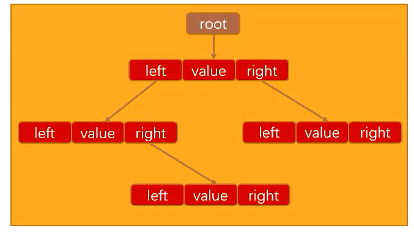

+ 封装保存节点的类Node
  + Node包含三个属性：当前节点的value，左节点，右节点

```ts
class Node<T> {
    value: T
    left: Node<T> | null
    right: Node<T> | null
    constructor(value: T) {
        this.value = value
    }
}
```

+ 对于BSTree来说，只需要保存根节点即可，因为其他节点可以通过根节点找到。

```ts
class BSTree<T = number> {
    root: Node<T> | null
}
```


https://blog.csdn.net/lyl123_456/article/details/102494659


