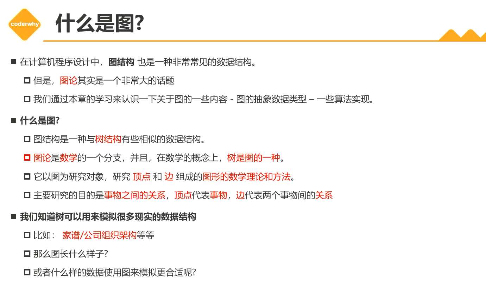
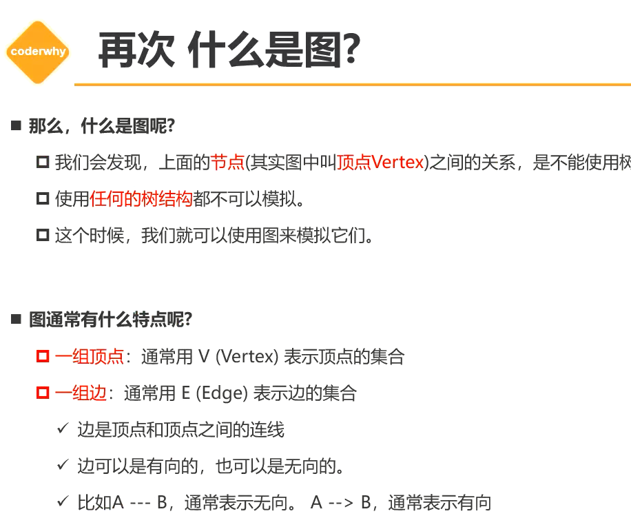

# 图结构（Graph）

## 1. 什么是图？

+ 图结构是一种与树结构有些相似的数据结构
+ 图论是数学的一个分支，并且，在数学概念上，树是图的一种
+ 它以图为研究对象，研究定点和边组成图形的数学理论和方法
+ 主要研究事物之间的关系，顶点代表事物，边代表两个事物间的关系

+ 案例：
  + 六度空间理论
  + 地铁图，导航

+ 特点：
  + 一组顶点（Vertex）：通常用V（Vertex）表示顶点的集合
  + 一组边：通常用E（Edge）表示边的集合
    + 边是顶点和顶点之间的连线
    + 边可以是有向的，也可以是无向的。

## x. 图包

