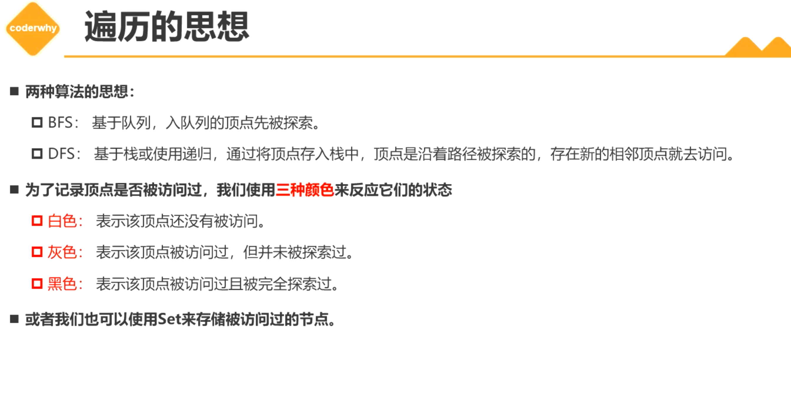

# 图结构（Graph）

## 1. 什么是图？

+ 图结构是一种与树结构有些相似的数据结构
+ 图论是数学的一个分支，并且，在数学概念上，树是图的一种
+ 它以图为研究对象，研究定点和边组成图形的数学理论和方法
+ 主要研究事物之间的关系，顶点代表事物，边代表两个事物间的关系

+ 案例：
  + 六度空间理论
  + 地铁图，导航

+ 特点：
  + 一组顶点（Vertex）：通常用V（Vertex）表示顶点的集合
  + 一组边：通常用E（Edge）表示边的集合
    + 边是顶点和顶点之间的连线
    + 边可以是有向的，也可以是无向的。

## 2. 欧拉解答

+ 连通图可以一笔画的充要条件：
  + 奇点的数目不是0个就是2个
  + 如果一点的边数如果是奇数条，就成为奇点
  + 如果是偶数条就成为偶点
  + 如果想要一笔画成，必须中间点均是偶点，也就是奇点只能在两端，要么不存在奇点。
+ 抽象是数学的本质
+ 汇编语言是对机器语言的抽象，高级语言是对汇编语言的抽象。
+ 操作系统是对硬件的抽象，应用程序在操作系统的基础上的构建

## 3. 图的术语

+ 顶点：图的节点
+ 边：顶点之间的连线
+ 相邻顶点：连起来的两个顶点
+ 度：一个顶点的度是相邻顶点的数量
+ 路径：路径是顶点到另一个顶点的连续序列。
  + 简单路径：没有重复顶点
  + 回路：第一个顶点和最后一个顶点是同一个
+ 无向图：边没有方向
+ 有向图：边有方向
+ 无权图：表示边没有其他意义
+ 带权图：带权图表示边有一定的权重，这个权重可以是距离，时间等

## 4. 图的表示

数组存储顶点。

### 4.1 邻接矩阵

### 4.2 邻接表

+ 出度：一个顶点指向的别的顶点数量
+ 入度：指向自己的数量

## 5. 创建图类

## 6. 图的遍历

+ 图的遍历意味着将每个顶点访问一遍，并且不能有重复的访问。

+ 图的遍历方式：
  + 广度优先搜索（Breadth-First Search BFS）
  + 深度优先搜索（Depth-First Search DFS）
+ 两种遍历方式都需要指定第一个被访问的顶点。  

## 7. 广度优先搜索

+ 从图上看优点像树的层次遍历

## 8. 深度优先搜索

+ 本次代码的设计，先看下面的图

1. 先放入第一个点A
2. 取出A，相连的顶点，看表，反方向放入即 D C B
3. 取出B，关联的E F 逆向放入，A已经被访问过，不放入，即， D C F E
4. 取出E， 放入I，D C F I
5. 取出I，此时栈中D C F
6. 取出 F
7. 取出 C，放入 G D，此时栈中为D G
8. 取出G，此时剩下D
9. 取出D，放入H
10. 取出H，栈为空结束

+ 代码设计。设计一个栈，放入逆向放入相关的顶点，存在的顶点和访问过的不再放入。然后循环取出。

+ ts的一个缺点，你为了做一些类型缩小，要写一些实际上不需要写的判断啊语句。

## x. 图包

