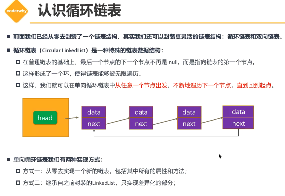
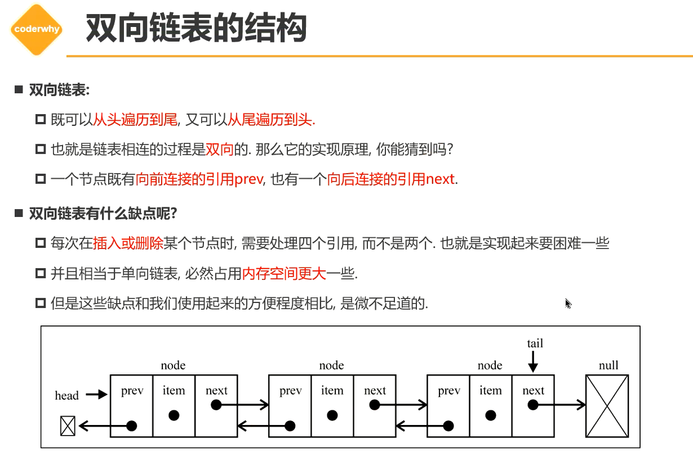
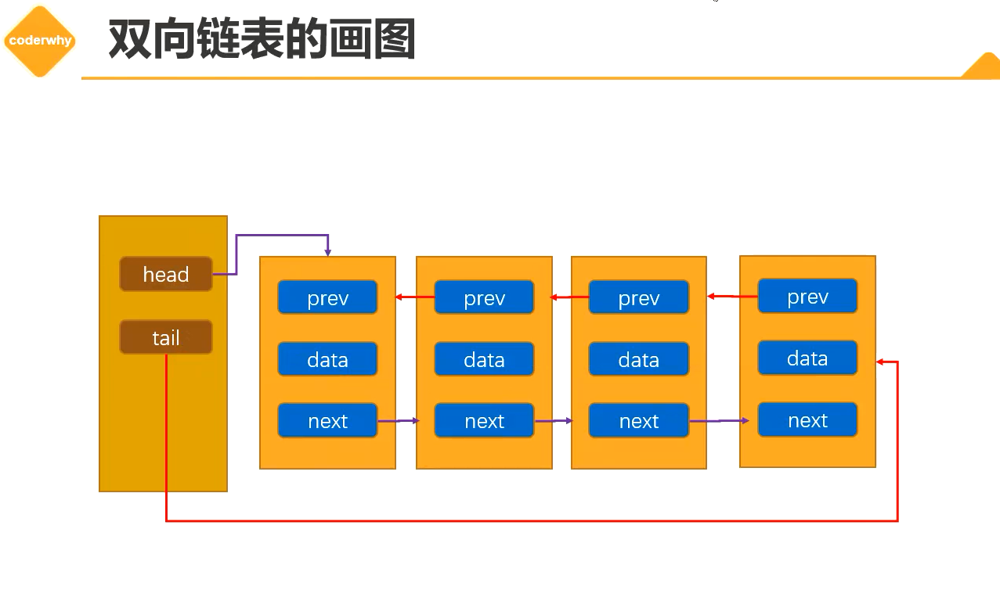

# 循环链表

+ 循环链表（**Circular LinkedList**）是一种特殊的链表数据结构，例如循环链表和双向链表
  + 在普通链表的基础上，最后一个节点的下一个节点不再是null，而是指向链表的第一个节点。
  + 这样形成了一个环，使得链表能够被无限遍历。
  + 单向循环链表中从任意一个节点出发，不断遍历下一个节点，直到回到起点（即第一个节点）。
+ 单向循环链表
  + 方式一：从0实现
  + 方式二：继承LinkedList

+ 在使用继承的时候super还挺好用的，直接调用父类方法

## x. 图包

