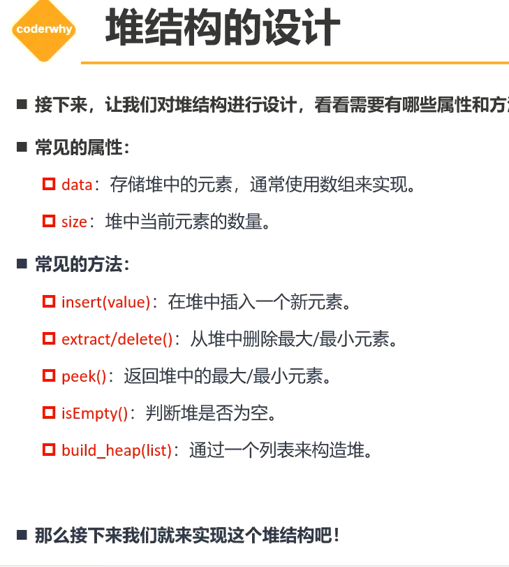
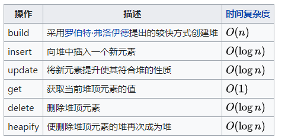
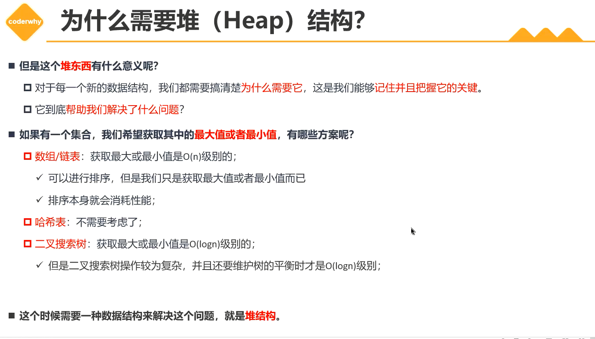
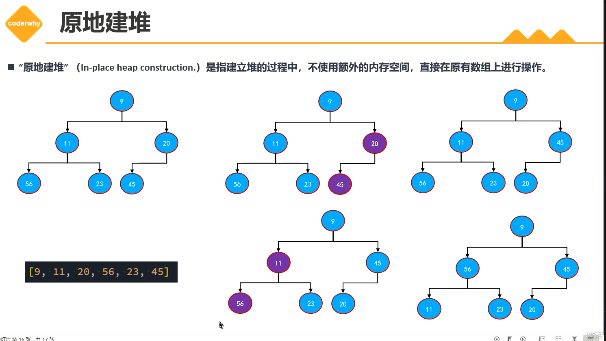
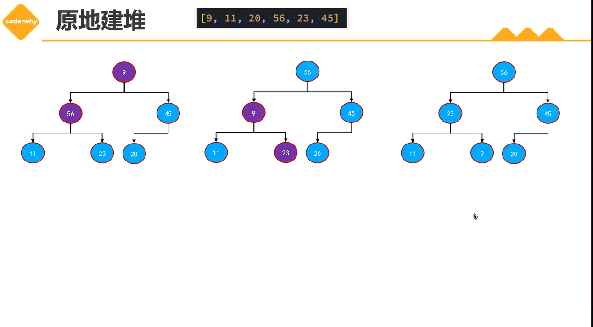

# 堆结构(Heap)

+ 堆的本质是一种特殊的树形数据结构，使用完全二叉树来实现。
  + 堆可以进行很多分类，但是平时使用的基本都是二叉堆（主要学习二叉堆）
  + 二叉堆又可以划分为最大堆和最小堆
+ 完全二叉树：就是除了最后一层，其他层符合满二叉树。然后最后一层的节点，从左往右连续铺满

+ 最小堆：堆中每个节点都小于等于它的子节点
+ 最大堆：堆中每个节点都大于等于它的子节点
+ 判断最大堆最小堆之前需要判断是否完全二叉树

## 1. 堆结构的优点

+ Top K问题：一组数据，每次取出最大值或最小值。
  + 数组/链表，需要的时间复杂度O(n)
    + 进行排序后再获取O(log n)
  + 哈希表：不适用
  + 二叉搜索树：O(log n)
    + 维护二叉搜索树需要的时间复杂度也是O(log n)，维护平衡也需要性能
    + 有可能退化成链表

+ 使用最大堆/最小堆，直接取顶点O(1)
+ 处理Top K最常用的就是堆排序
+ 二叉堆用树形结构表示出来时一颗完全二叉树，在代码实现的时候底层一般会使用数组来实现。
  + 之前我们实现搜索二叉树的时候，用的是链表的结构，TreeNode节点中拥有左右节点的指向

## 2. 为啥我们的二叉堆使用的是数组呢？

+ 明明二叉搜索树用链表。


+ 我们的二叉堆是完全二叉树。层序遍历放入到数组中，第一个节点是top节点，然后按顺序存入数组。每个位置与堆的树结构一一对应。

+ 当我们有一个非叶子结点，例如4，可以推导其子节点在数组的位置左节点`2*i+1`右节点`2*i+2`
+ 节点的父节点位置可以推导出`Math.floor( (i -1) / 2)`

```js
父节点： Math.floor( (i -1) / 2)

左孩子：2*i+1

右孩子: 2*i+2
```

+ 完全二叉树用数组表示，符合上面的公式，这就是为什么堆用数组来表示

## 3. 堆结构设计



## 4. 上滤（percolate up）

+ 上滤一般应用于在一个**已经排序好**的二叉堆中插入一个新节点。
+ 每次插入元素之后，需要对堆进行重构，使得堆容纳了新节点后保持原来的堆序，这种策略就叫上滤。

1. 堆末新建一个空间，成为空穴（hole）
2. 比较空穴与父节点，满足当前堆的特点（即最小/大堆）就保留，否则交换位置
3. 然后继续与父节点比较，空穴**自下而上**达到满足堆序的位置，称之为上滤。

+ 用上滤完成堆序：建立一个数组，遍历无序数组的每个元素，依次对新数组执行堆的插入操作，每次插入都执行一次**上滤**的过程。

## 5. 下滤（percolate down）

+ 每次删除元素之后，需要对堆进行重构，使得堆容纳了新节点后保持原来的堆序，这种策略就叫下滤。

+ 下滤一般应用于删除了堆顶后的堆序重整过程中。

+ 下滤完成堆序：直接从数组中抽象的最后一个非叶子节点开始，对经过的每个节点执行一次**下滤**的过程，直到抽象的堆顶结束。

1. 提取最大的数字后，最后一个数字提到第一个位置（即完全二叉树最后一个顶点移动到顶点）
2. 开始下滤操作：最后一个值现在位置在index=0，左子结点（2 * index + 1），右子节点（2 * index + 2）
3. 比较左右节点，找出最大的一个largerIndex
4. 停止条件：如果largerIndex的元素小于index元素。直接break
5. 没有停止：交换swap（index， largerIndex）
6. index= largerIndex继续下滤
7. 循环结束的条件。没有左子结点的时候，说明到了叶子结点，即（2 * index + 1 < this.length)

+ 下滤操作时间复杂度为O(log n)


## 6. 网址

https://www.cs.usfca.edu/~galles/visualization/Algorithms.html

https://visualgo.net/zh/list?slide=1

https://btv.melezinek.cz/home.html



## 7. 原地建堆

+ 一开始我们建立大小堆的方式，是在给定的数组基础上，遍历insert进去，在新的数组里通过上滤操作建立起堆。
+ 原地建堆不用新的数组，而是，在原来的数组上，让它变成一个有序的堆。即不使用额外的数组空间，在原有数组上进行操作。

+ 一般使用的做法：
  + 从第一个非叶子节点开始下滤操作


## x. 图包








