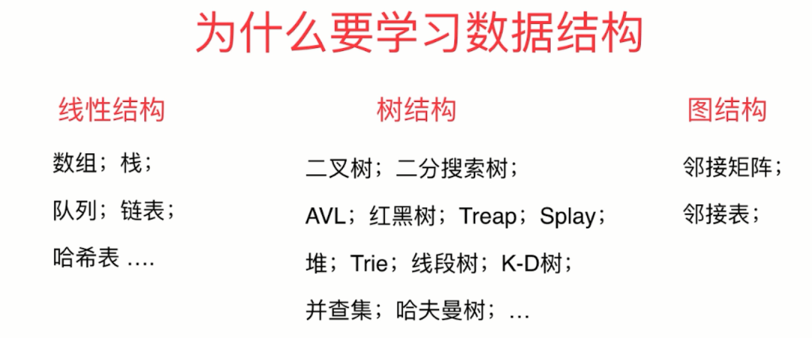

# 1. 为什么要学习数据结构

+ 数据结构研究的是数据如何在计算机中进行组织和存储,使得我们可以高效的获取数据或者修改数据。
+ 数据结构可以分成三种结构：**线性结构** **树结构** **图结构**

+ 脚本语言：（非编译性语言）依靠解析器在运行时进行解析来得到最终结果的语言。这种语言不适于用于考察数据结构（和算法）的性能。因为对于脚本语言代码性能不仅仅与你的逻辑相关，会非常的依赖自身的语法写法相关。

reactive中使用到ref的时候可以直接不带value，此时reactive代理了ref的值，但是如果是计算的话，就不是响应式了

策略模式

form-item

table抽一个图片类

·

