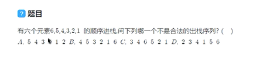
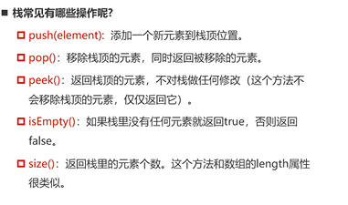
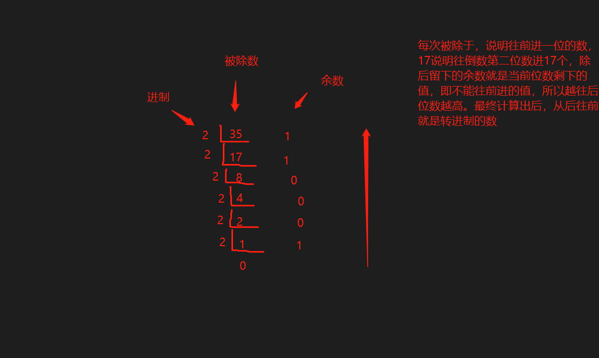

+ 编程的目的只有一个：对数据进行操作和处理。
+ 当你拿到这些数据时，以什么样的方式存储和处理会更加方便、高效、也是评判一个开发人员能力的重要指标。
+ 数据结构与算法的本质就是一门专门研究数据如何组织、存储和操作的科目。

+ JavaScript数据结构和算法，大话数据结构

## 线性结构（Linear List）

+ 是由n (n≥0) 个数据元素(结点)，a[0], a[1]...a[n-1]组成的有限序列。
+ 数据元素的个数n定义为表的长度，长度为0表示空表。
+ 常见的线性结构：
  + 数组、链表；队列和栈是受限制的线性结构，pop和push受限制。

## 数组（Array）结构

+ 几乎每种编程语言都会提供的一种**原生数据结构**。
+ 可以借助于数组结构来实现其他的数据结构：栈（Stack）、队列（Queue）、堆（Heap）
+ 通常数组的内存是连续的，所以数组在知道下标值的情况下，访问效率非常高。
+ 数组可以任意位置插入和删除数据。
+ 缺点是数组在中间插入元素效率是比较低的，原因也是内存是连续的。

## 栈（Stack）结构

+ 后进先出（Last In First Out）也可以叫 先进后出（First In Last Out）
+ 栈是一种受限的线性结构，后进先出。
+ 其限制是仅允许在表的一端进行插入和删除运算，这一端被称为栈顶，另一端称为栈底。
+ 向一个栈插入新元素又称作进栈、入栈或压栈，它是把新元素放到栈顶元素的上面，使之成为新的栈顶元素。
+ 从一个栈删除元素又称作出栈或退栈，它是把栈顶元素删除。

### 栈结构的实现

+ 想要运行`ts`在node环境，需要安装`ts-node`

+ 项目中`ts`文件运行在一个作用域中，导致多个文件相同命名冲突，可以在文件结尾使用`export {}`，限制当前作用域。

+ 类的有点，继承和多态。 

  + 继承/接口是实现多态的前提

  + 多态同一个行为具有多个不同表现形式或形态的能力。
  + 多态就是同一个接口，使用不同的实例而执行不同的操作。

  https://blog.csdn.net/buhuisuanfa/article/details/126328356

  https://juejin.cn/post/7019265063223558180

### 面试题: 十进制转二进制

.

### 有效的括号(leetcode20)

给定一个只包括`()`，`{}`，`[]`的字符串s，判断字符串是否有效。

