# 一. 链表结构(Linked List)

## 1. 链表以及数组的缺点

+ 链表和数组一样，可以用于存储一些列的元素，但是链表和数组的实现机制完全不同。
+ 线性结构：链表

### 1.1 数组

+ 数组的创建通常需要申请一段连续的内存空间(一整块内存),并且大小是固定的(大多数编程语言数组都是固定的),所以当前数组不能满足容量需求时，需要扩容。(一般情况下是申请一个更大的数组,比如2倍,然后将原数组中的元素复制过去)
+ 数组开头或者中间位置插入数据的成本很高,需要进行大量的位移。
+ 尽管JavaScript的Array底层可以帮我们做这些事,但背后的原理依然是这样。

## 1.2 链表的优势

+ 要存储多个元素,另外一个选择就是链表。
+ 但不同于数组,链表中的元素在内存中不必是连续的空间。
  + 链表的每个元素由一个存储元素本身的节点和一个指向下一个元素的引用（有些语言称之为指针或者链接）组成。

+ 相对与数组，链表有一些优点：
  + 内存空间不是必须连续的。
    + 可以重复利用计算机的内存，实现灵活的内存动态管理。
  + 链表不必再创建时就确定大小，并且大小可以无限地延伸下去。
  + 链表在插入和删除数据时，时间复杂度可以达到`O(1)`
    + 相对数组效率高很多。
+ 相对于数组，链表的缺点：
  + 链表访问任何一个位置的元素时，都需要从头开始访问。（无法跳过第一个元素访问任何一个元素）
  + 无法通过下标直接访问元素，需要从头一个个访问，直到找到对应的元素。

## 2. 什么是链表

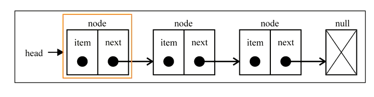

+ 封装一个Node类，用于封装没一个节点上的信息（包括值和指向下一个节点的引用），它是一个泛型类。

```ts
// 1. 创建Node节点类
class Node<T> {
  value: T;
  next: Node<T> | null = null; //指针

  // 实例的时候完成赋值操作
  constructor(value: T) {
    this.value = value;
    this.next = null;
  }
}
```

+ 封装一个`LinkedList`类，用于表示链表结构。（java中的链表同名，不同java中的这个类是一个双向链表）
  + 链表中保存两个属性，一个链表的长度，一个链表中的第一个节点

```ts
// 2. 创建LinkedList类
class LinkedList<T> {
  head: Node<T> | null = null; // 头结点
  private size: number = 0; // private表示私有的，外部不能直接访问

  get length() {
    return this.size;
  }
}
```

## 3. 链表常见操作

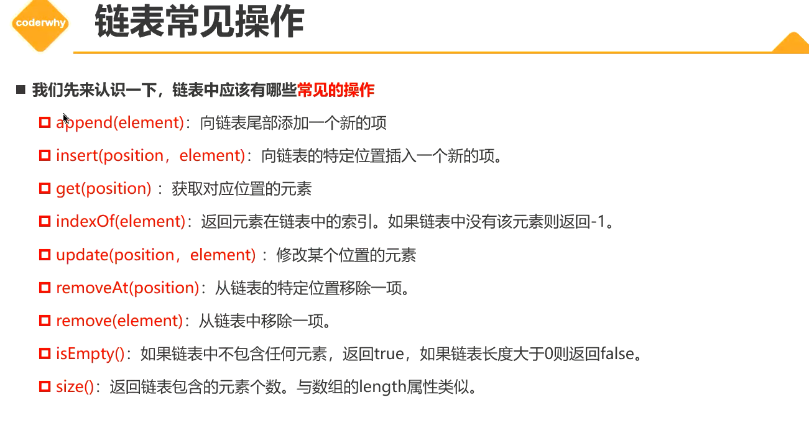

### 3.1 append方法

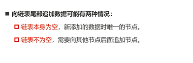

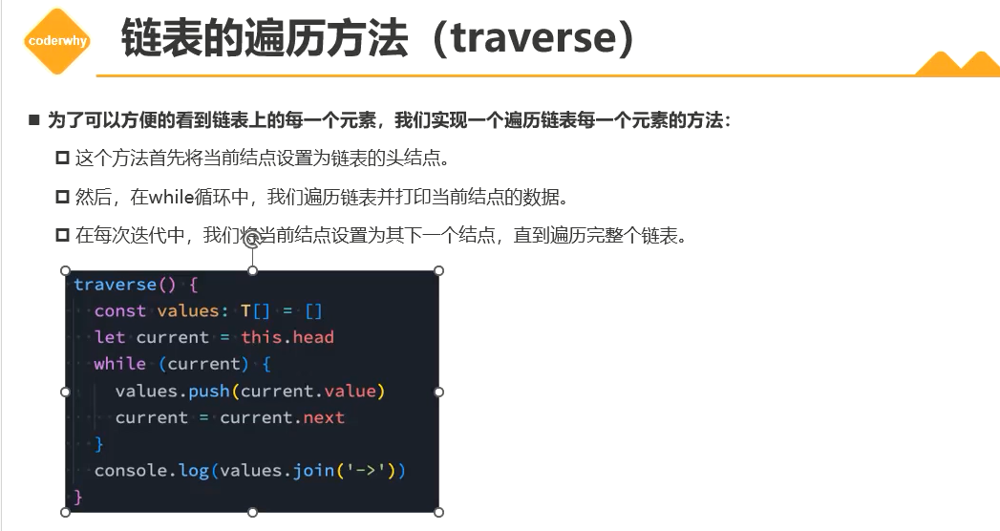


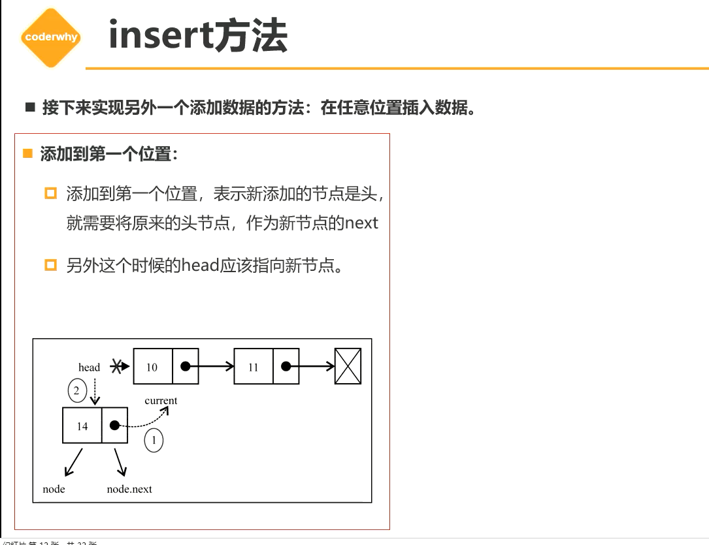

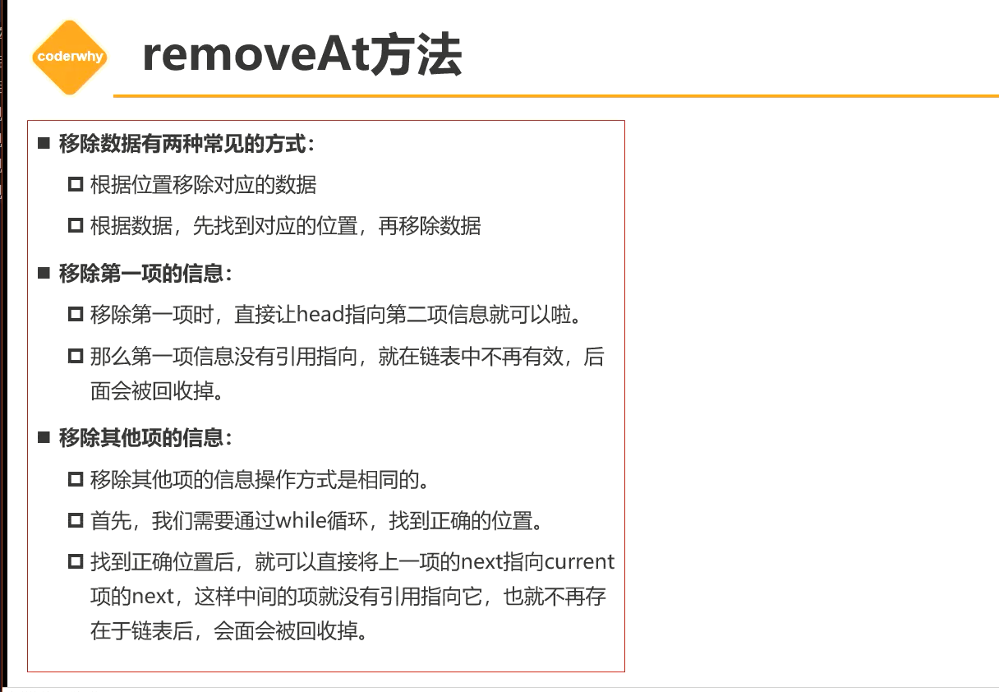


Ctrl+K Ctrl+0 折叠所有代码


## 4. 笔试题

`LeetCode`: 707

`LeetCode`: 237

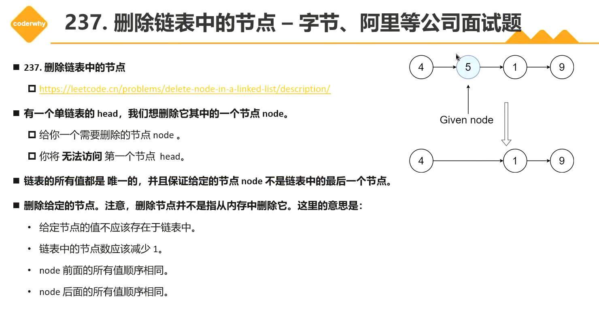

`leetCode`: 206 反转链表

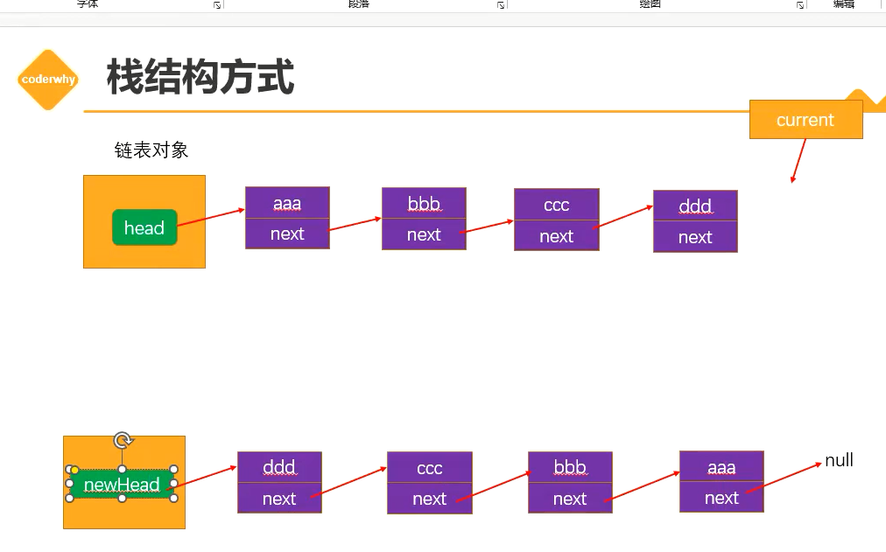


非递归思路:

1. 给到一个链表，当我们需要反转链表，可以定义一个反转链表的头节点。

   定义一个current保存当前被操作的节点的next，意味着它指向下一个节点。

   ```ts
   const current = head.next
   ```

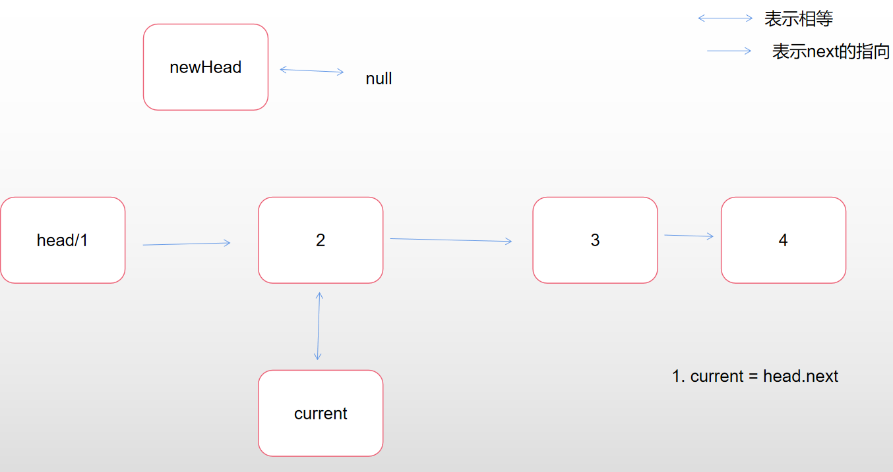

2. head除了表示头节点，在这里，我们巧妙的利用它不断地移动，作为当前操作的节点的指针，每次完成反转head.next指向newHead的时候，head成了反转链表的头节点，而newHead保存整个反转链表的头节点。然后重新让newHead等于head，从而完成newHead变为新的反转链表头节点。

   ```ts
   head.next = newHead
   ```

   第一次反转的时候，head节点既是第一个节点，同时也作为当前操作节点的变量或者叫指针。反转后，head.next指向已经反转完成的链表newHead，此时head为新链表的头节点。即当前操作的节点完成了反转。

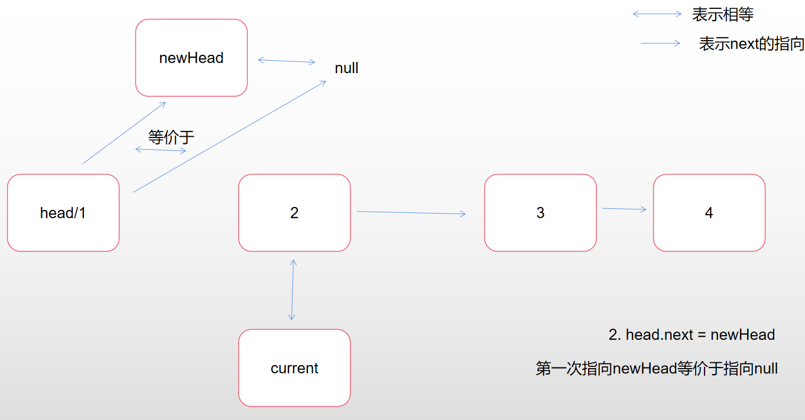

3. 让newHead指向Head节点

   ```ts
   newHead = head
   ```

   newHead重新等价于head，意味着newHead和head一样，成为了新链表的头节点，意味着newHead保存着新的反转链表。这时候我们就可以继续移动head。

   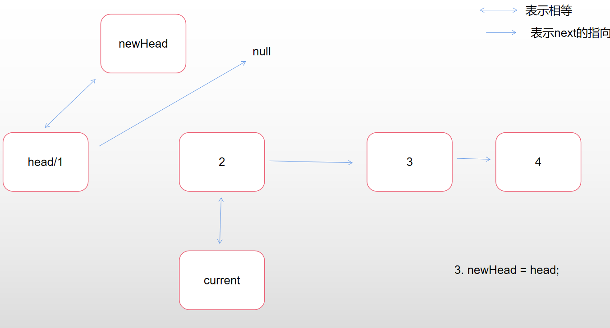

4. 让head移向下一个节点，指向current

   ```ts
   head = current
   ```

   这样子就完成了一轮操作，操作的节点完成了反转，newHead也重新成为头节点，然后head重新等于下一个节点。

   在下一轮操作的时候，current继续指向下一个节点，而head.next指向newHead后，完成当前节点反转，newHead重新回到头节点，head继续下移动。

   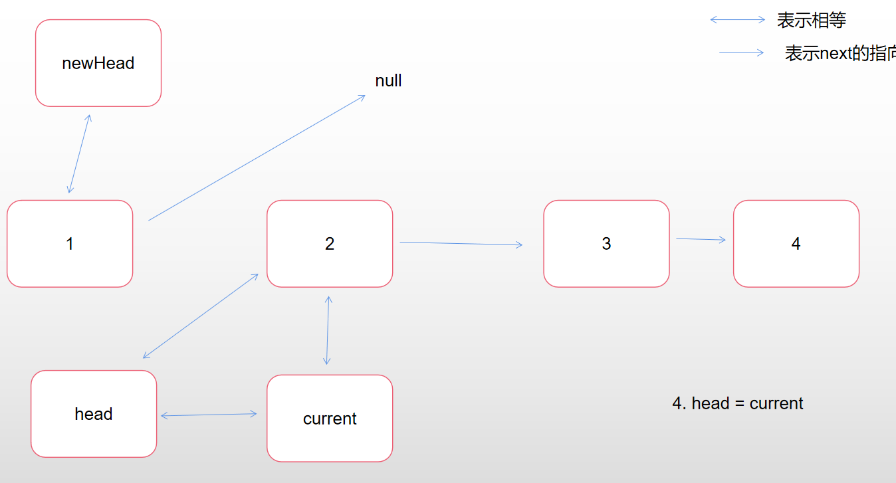

   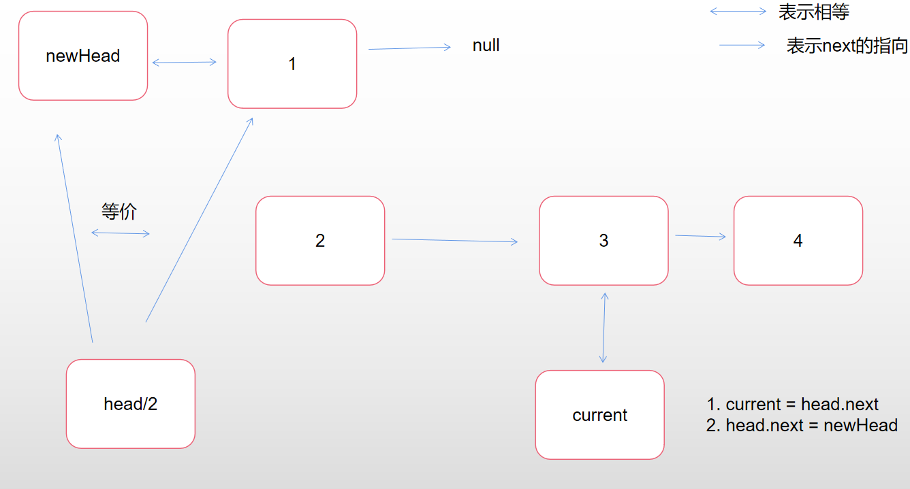

   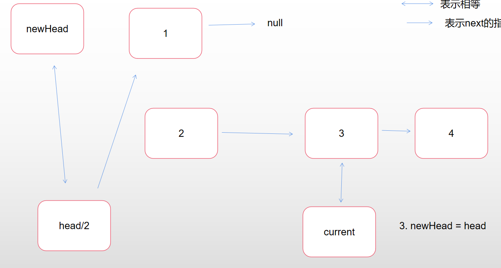

   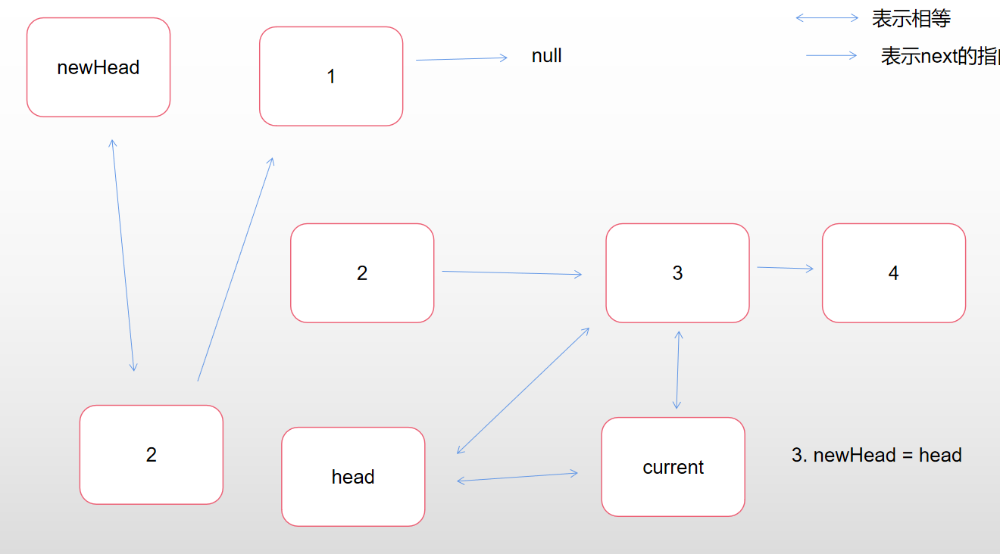


